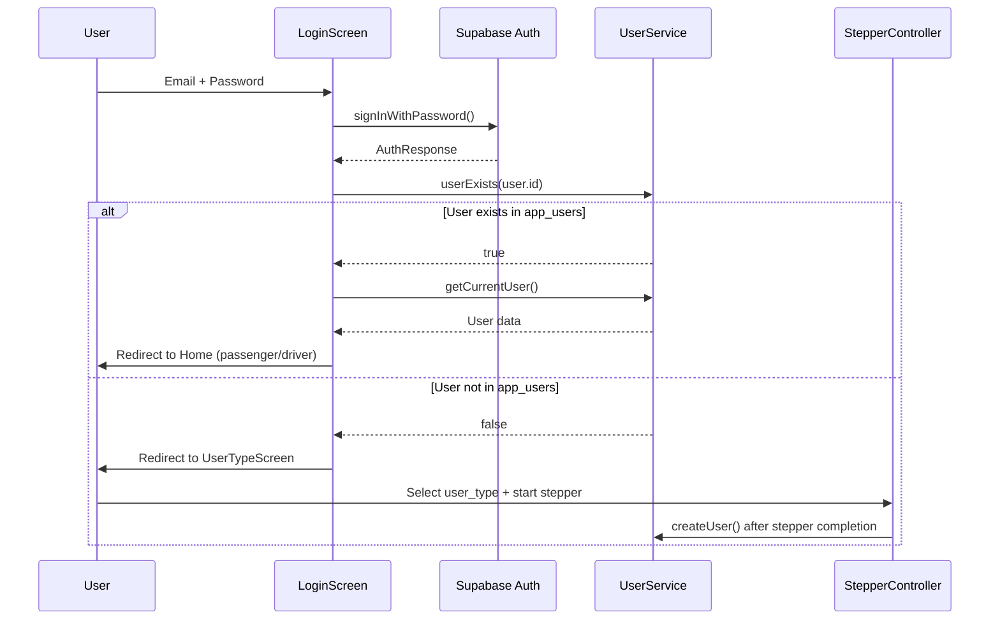
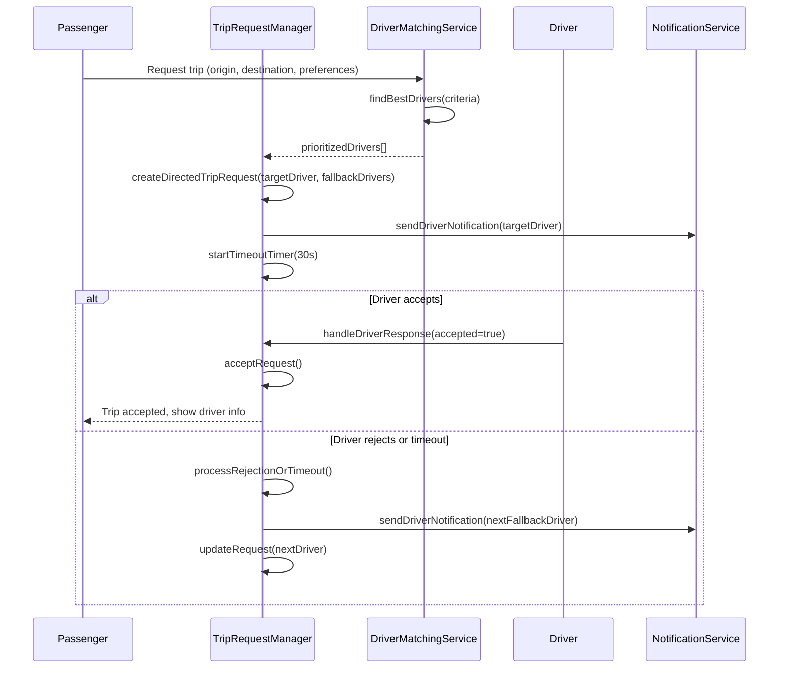
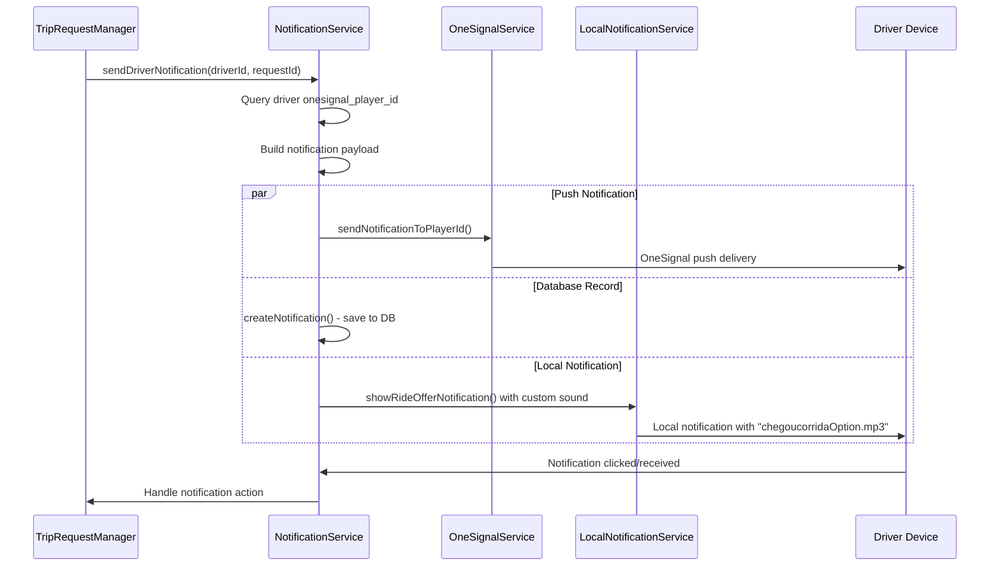
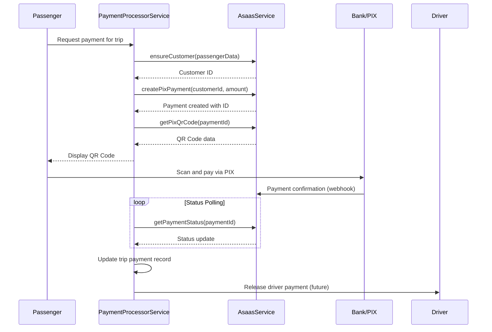
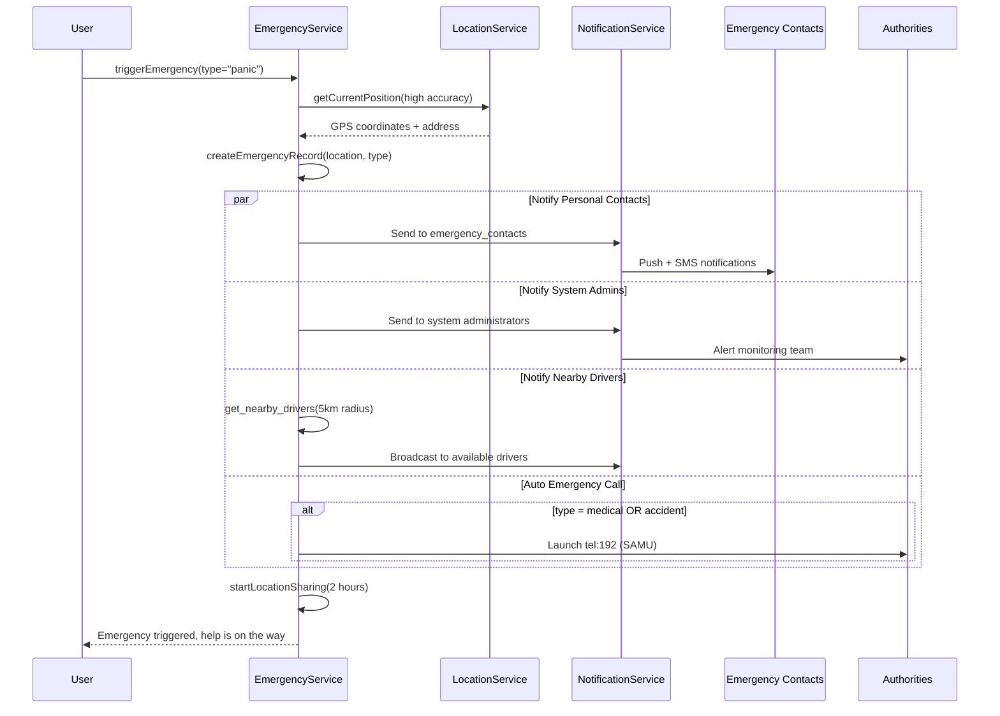
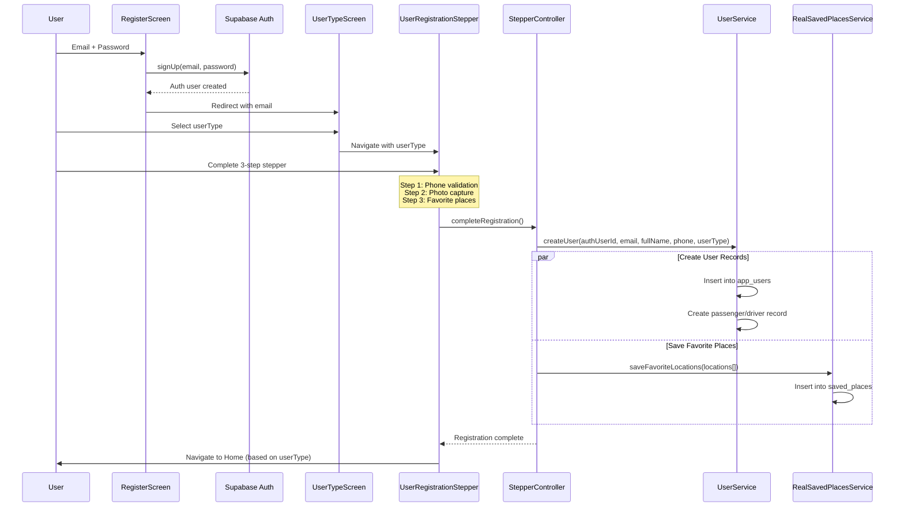
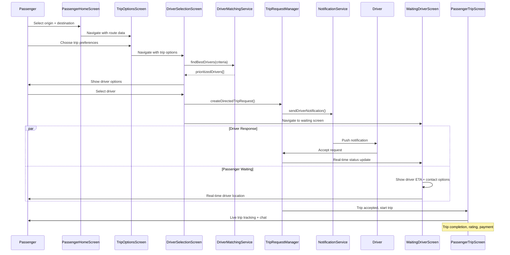

# DOCUMENTAÇÃO COMPLETA - ARQUITETURA E FLUXOS DO PROJETO OPTION

## VISÃO GERAL DO SISTEMA

**Option** é um aplicativo de mobilidade urbana desenvolvido em Flutter, com backend Supabase, que conecta passageiros e motoristas através de um sistema inteligente de matching, notificações em tempo real e pagamentos digitais.

### TECNOLOGIAS PRINCIPAIS
- **Frontend**: Flutter (Material Design 3)
- **Backend**: Supabase (PostgreSQL + Realtime + Auth + Storage)
- **Mapas**: Google Maps API
- **Notificações**: OneSignal + Local Notifications
- **Pagamentos**: Asaas (PIX)
- **Localização**: Geolocator + Google Places

---

## 1. ARQUITETURA DO SISTEMA

### 1.1 Estrutura de Dados Principais

**USUÁRIOS**
```
app_users (tabela central)
├── id (PK, UUID do auth.users)
├── email, full_name, phone
├── user_type (passenger/driver)
├── status (active/inactive)
├── onesignal_player_id, push_token
└── timestamps (created_at, updated_at, last_active_at)

passengers (especialização)
├── user_id → app_users.id
├── rating, total_trips
└── consecutive_cancellations

drivers (especialização)  
├── user_id → app_users.id
├── vehicle_info (brand, model, year, color, plate, category)
├── documents (cnh_number, cnh_photo_url, crlv_photo_url)
├── approval_status, is_online
├── location (current_latitude, current_longitude)
├── preferences (accepts_pet, accepts_grocery, accepts_condo)
├── pricing (custom_price_per_km, custom_price_per_minute)
├── ratings, trips, cancellations
└── payment_info (bank_data, pix_data)
```

**VIAGENS E SOLICITAÇÕES**
```
trip_requests
├── id, passenger_id → app_users.id
├── origin/destination (address, latitude, longitude, neighborhood)
├── vehicle_category, preferences (needs_pet, needs_ac, etc.)
├── estimations (distance_km, duration_minutes, fare)
├── matching (target_driver_id, fallback_drivers[], current_fallback_index)
├── status (pending/accepted/expired/cancelled)
└── timing (created_at, expires_at, accepted_at)

trips
├── id, trip_request_id → trip_requests.id
├── driver_id → app_users.id, passenger_id → app_users.id
├── route (origin/destination addresses and coordinates)
├── metrics (actual_distance_km, actual_duration_minutes)
├── pricing (base_fare, final_fare)
├── ratings (driver_rating, passenger_rating)
├── timing (start_time, end_time)
└── status (ongoing/completed/cancelled)
```

### 1.2 Relacionamentos e Integridade

- **1:1** app_users ↔ passengers/drivers
- **1:N** passengers → trip_requests → trips
- **1:N** drivers → trips (quando aceitas)
- **M:N** drivers ↔ excluded_zones (zonas que não atendem)
- **1:N** users → notifications, emergency_contacts, saved_places

---

## 2. FLUXOS DE AUTENTICAÇÃO E REGISTRO

### 2.1 Componentes Principais

**Login Flow**
```dart
LoginScreen (lib/screens/auth/login_screen.dart:31-88)
├── Validação: email format + password ≥6 chars
├── Supabase.auth.signInWithPassword()
├── UserService.userExists() → verifica app_users
├── Se existe: redirect based on user_type
└── Se não existe: redirect /select_user_type
```

**Registration Flow**
```dart
RegisterScreen → UserTypeScreen → UserRegistrationStepper
├── Step 1: PhoneStep - validação e formatação telefone
├── Step 2: PhotoStep - captura foto perfil (opcional)
├── Step 3: PlacesStep - configuração locais favoritos
└── StepperController.completeRegistration()
```

### 2.2 Fluxo de Dados Detalhado



### 2.3 Validações e Regras de Negócio

- **Email**: Regex `^[^\s@]+@[^\s@]+\.[^\s@]+$`
- **Password**: Mínimo 6 caracteres
- **Phone**: Máscara brasileira `(XX) XXXXX-XXXX`
- **User Type**: Enum restrito (passenger/driver)
- **Stepper**: Máximo 3 tentativas de finalização
- **CNH**: Validação de data de expiração (drivers)

---

## 3. SISTEMA DE MATCHING E VIAGENS

### 3.1 Componentes de Matching

**DriverMatchingService** (lib/services/driver_matching_service.dart)
```dart
findBestDrivers(MatchingCriteria criteria) → List<DriverMatchResult>
├── 1. getAvailableDriversInRegion() - busca por raio geográfico
├── 2. filterByPreferences() - pet, AC, grocery, condo
├── 3. filterByExclusionZones() - zonas excluídas por driver
├── 4. verifyRealTimeAvailability() - não em viagem ativa
└── 5. calculateMatchScores() - algoritmo de pontuação
```

**Algoritmo de Score** (40% distância + 30% rating + 20% experiência + 10% confiabilidade)
```dart
score = distanceScore(40%) + ratingScore(30%) + experienceScore(20%) + reliabilityScore(10%) + bonuses
```

### 3.2 TripRequestManager - Sistema Inteligente

**Fluxo de Solicitação Direcionada** (lib/services/trip_request_manager.dart:31-108)
```dart
createDirectedTripRequest(prioritizedDrivers, tripData)
├── Target: primeiro da lista prioritizada
├── Fallback: próximos motoristas como backup
├── TransactionService.executeWithPessimisticLock() - evita conflitos
├── Notification push para target driver
└── Timer de timeout com fallback automático
```

**Sistema de Fallback Automático**
- Timeout configurável (default: 30s)
- Máximo 3 tentativas de fallback
- Transição automática para próximo motorista
- Notificação ao passageiro se todos recusarem

### 3.3 Fluxo Completo de Viagem



---

## 4. SISTEMA DE NOTIFICAÇÕES

### 4.1 Arquitetura Multi-Camada

**OneSignalService** (lib/services/onesignal_service.dart)
```dart
Funcionalidades:
├── initialize() - configuração plataforma (mobile/web)
├── Player ID management - registro e sincronização
├── Push subscription handling - tokens e state management  
├── Notification handlers - foreground, click, permission
├── Segmentation - tags, email, user attributes
└── History logging - tracking completo
```

**NotificationService** (lib/services/notification_service.dart) 
```dart
Tipos de Notificação:
├── trip_request - solicitações para motoristas
├── trip_update - atualizações de status da viagem
├── chat_message - mensagens do chat in-app
├── emergency - alertas de emergência
└── general - notificações administrativas
```

**LocalNotificationService**
```dart
Recursos Especiais:
├── Custom sound - "chegoucorridaOption.mp3" para ofertas
├── Rich notifications - imagens, actions, big text
├── Channel management - diferentes prioridades
└── Platform optimization - iOS/Android specific
```

### 4.2 Fluxo de Notificação para Motorista



### 4.3 Segmentação e Targeting

**Tags Automáticas**:
- `user_type: driver/passenger`
- `vehicle_category: standard/premium/suv`
- `city: São Paulo` (baseado em localização)
- `online_status: true/false` (motoristas)

**Filters Inteligentes**:
- Motoristas online em raio específico
- Passageiros com trips recentes
- Usuários com app version específica

---

## 5. SISTEMA DE PAGAMENTOS

### 5.1 Integração Asaas

**AsaasService** (lib/services/asaas_service.dart)
```dart
Fluxo PIX:
├── ensureCustomer() - cria/busca customer por email
├── createPixPayment() - gera cobrança com QR Code  
├── getPixQrCode() - recupera código de pagamento
├── getPaymentStatus() - polling de status
└── cancelPayment() - cancelamento quando necessário
```

**PaymentProcessorService**
```dart
processPayment(tripId, amount, method)
├── Validation - amount > 0, method supported
├── Customer creation/lookup
├── Payment creation (PIX/card)
├── QR Code generation  
├── Status monitoring
└── Trip payment record creation
```

### 5.2 Fluxo Completo de Pagamento PIX



### 5.3 Estrutura de Taxas e Comissões

```dart
Trip Pricing Components:
├── Base fare - valor mínimo da corrida
├── Distance rate - R$/km (customizável por motorista)
├── Time rate - R$/min (tempo em trânsito)
├── Surge pricing - multiplicador em horários/áreas de alta demanda
├── Service fees:
│   ├── Platform commission (% do valor total)
│   ├── Pet fee - taxa adicional para pets
│   ├── Grocery fee - taxa para compras/mercado
│   ├── Condo fee - taxa para condomínios
│   └── Stop fee - taxa por parada adicional
└── Cancellation fee - multa por cancelamento tardio
```

---

## 6. SISTEMA DE EMERGÊNCIA

### 6.1 Componentes de Segurança

**EmergencyService** (lib/services/emergency_service.dart)
```dart
triggerEmergency(type, description?)
├── getCurrentLocation() - captura GPS precisa
├── createEmergencyRecord() - salva no banco
├── sendEmergencyNotifications():
│   ├── notifyEmergencyContacts() - contatos pessoais
│   ├── notifySystemAdministrators() - equipe suporte
│   └── notifyNearbyDrivers() - motoristas em 5km
└── promptEmergencyCall() - liga para 192 (SAMU)
```

**Tipos de Emergência**:
- **Panic** - botão de pânico geral
- **Medical** - emergência médica (auto-liga SAMU)
- **Accident** - acidentes de trânsito
- **Security** - problemas de segurança
- **Other** - outras situações

### 6.2 EmergencyScreen - Interface Principal

**Funcionalidades** (lib/screens/emergency/emergency_screen.dart):
- **Botão de emergência** - trigger rápido e visível
- **Compartilhamento de localização** - tempo real por 2h
- **Histórico de emergências** - log completo com status
- **Gestão de contatos** - emergency_contacts_screen

### 6.3 Fluxo de Emergência Completo



---

## 7. INTERFACES DE USUÁRIO E NAVEGAÇÃO

### 7.1 Estrutura de Navegação

**App Routes** (lib/main.dart:148-177):
```dart
Authentication Flow:
'/login' → LoginScreen
'/register' → RegisterScreen  
'/select_user_type' → UserTypeScreen
'/registration_stepper' → UserRegistrationStepper

Passenger Flow:
'/home' → PassengerHomeScreen
'/trip_options' → TripOptionsScreen
'/driver_selection' → DriverSelectionScreen
'/waiting_driver' → WaitingDriverScreen
'/passenger_trip' → PassengerTripScreen

Driver Flow:
'/driver_home' → DriverHomeScreen
'/driver_requests' → DriverRequestsScreen
'/driver_trip' → DriverTripScreen
'/driver_operation_zones' → DriverOperationZonesScreen

Shared Screens:
'/user_menu' → UserMenuScreen / DriverMenuScreen
'/notifications' → NotificationsScreen
'/emergency' → EmergencyScreen
'/profile_edit' → ProfileEditScreen
```

### 7.2 PassengerHomeScreen - Tela Principal

**Componentes** (lib/screens/passenger/passenger_home_screen.dart):
```dart
Main Features:
├── GoogleMap - full screen com markers personalizados
├── DraggableScrollableSheet - bottom sheet responsivo
├── Location cards - origem e destino com autocomplete
├── Recent destinations - histórico inteligente
├── Route animation - polyline animada da rota
└── Trip button - habilitado quando origem+destino selecionados

Map Integration:
├── Custom markers - origem (verde) e destino (vermelho) 
├── Real-time location - position stream com filtro 5m
├── Route calculation - Google Directions API
├── Camera bounds - auto-fit para mostrar rota completa
└── Map styling - adaptado ao tema claro/escuro
```

### 7.3 Estados e Transições da UI

**Authentication States**:
```
Not Authenticated → Login → [User Exists?] → Home
                      ↓         No ↓
                   Register → UserType → Stepper → Home
```

**Trip States (Passenger)**:
```
Home → TripOptions → DriverSelection → WaitingDriver → TripActive → TripCompleted
  ↑                                         ↓              ↓
  └──────────── Cancel ←────────────────────┴──────────────┘
```

**Driver States**:
```
DriverHome → [Online?] → ReceiveRequest → [Accept?] → TripActive → TripCompleted
     ↑           No ↓            ↓            No ↓
     └─── Offline Mode    Auto-fallback ←──────┘
```

---

## 8. DIAGRAMAS DE SEQUÊNCIA DOS PRINCIPAIS FLUXOS

### 8.1 Registro Completo de Usuário



### 8.2 Fluxo Completo de Solicitação de Viagem



---

## 9. REGRAS DE NEGÓCIO E VALIDAÇÕES

### 9.1 Validações de Dados

**User Registration**:
```dart
UserDataValidator.validateUserData():
├── Full name: trim, length 2-100 chars, no special chars
├── Email: regex pattern, domain validation, uniqueness check
├── Phone: Brazilian format (XX) XXXXX-XXXX, uniqueness check
├── User type: enum validation (passenger|driver only)
└── Photo URL: valid URL format, accessible endpoint
```

**Driver Specific**:
```dart
Driver Document Validation:
├── CNH number: 11 digits, Luhn algorithm validation
├── CNH expiry: must be > 30 days from now  
├── Vehicle plate: Brazilian format ABC-1234 or ABC1D23
├── Vehicle year: between 2005 and current_year+1
└── CRLV document: file upload with size/format validation
```

**Trip Validations**:
```dart
TripRequest Business Rules:
├── Minimum distance: > 500m (avoid very short trips)
├── Maximum distance: < 100km (city limits)
├── Fare estimation: base_fare + (distance_km * rate_per_km) + (duration_min * rate_per_min)
├── Driver availability: online + not_in_active_trip + approved_status
└── Geographic limits: within supported city boundaries
```

### 9.2 Regras de Matching

**Driver Selection Priority**:
1. **Distance Score (40%)** - motoristas mais próximos preferidos
2. **Rating Score (30%)** - médias 4+ estrelas têm vantagem
3. **Experience Score (20%)** - > 100 viagens = score máximo
4. **Reliability Score (10%)** - baixo índice de cancelamentos

**Preference Matching**:
- Pet required → only drivers with accepts_pet=true
- AC required → exclude drivers with ac_policy='never'  
- Grocery space → only drivers with accepts_grocery=true
- Condo destination → only drivers with accepts_condo=true

**Zone Exclusions**:
- Drivers can exclude specific neighborhoods/cities
- System automatically filters excluded zones during matching
- Bulk zone checking for performance optimization

### 9.3 Regras de Pagamento

**Pricing Rules**:
```dart
Trip Fare Calculation:
├── base_fare = R$ 5.00 (minimum charge)
├── distance_component = distance_km * price_per_km  
├── time_component = duration_minutes * price_per_minute
├── surge_multiplier = 1.0 to 3.0 (based on demand)
├── service_fees = pet(R$5) + grocery(R$3) + condo(R$2) + stops(R$2/stop)
└── final_fare = (base_fare + distance + time) * surge + service_fees
```

**Cancellation Rules**:
- Free cancellation: < 5 minutes after request
- Cancellation fee: R$ 7.00 if > 5 minutes
- Driver no-show: free cancellation + driver penalty
- Excessive cancellations: temporary account restrictions

---

## 10. ARQUITETURA DE SEGURANÇA E PERFORMANCE

### 10.1 Medidas de Segurança

**Authentication & Authorization**:
- Supabase RLS (Row Level Security) em todas as tabelas
- JWT tokens com refresh automático
- Rate limiting em endpoints críticos
- Input sanitization em todos os forms

**Data Protection**:
- Criptografia de dados sensíveis (CPF, CNH)
- HTTPS obrigatório em todas as comunicações  
- Logs auditados sem dados pessoais
- LGPD compliance com opt-out mechanisms

**Emergency Security**:
- Emergency button sempre acessível
- Location sharing com auto-expiry
- Admin panic notifications
- Integration with authorities (SAMU 192)

### 10.2 Otimizações de Performance

**Database Optimizations**:
- Índices compostos em queries frequentes
- Spatial indexes para consultas geográficas
- Connection pooling e query caching
- Archived data para trips antigas

**Mobile Performance**:
- Image caching e compression
- Lazy loading de listas grandes
- Background location com batch updates
- Map marker clustering em alta densidade

**Caching Strategy**:
- Driver location cache (2 min TTL)
- Recent destinations local cache
- Map tiles caching
- API response caching com invalidation

---

## 11. MONITORAMENTO E MÉTRICAS

### 11.1 Métricas de Negócio

**KPIs Principais**:
```dart
Trip Metrics:
├── Trip completion rate (target: >95%)
├── Average matching time (target: <15s)
├── Driver acceptance rate (target: >80%)
├── Passenger cancellation rate (target: <5%)
└── Average trip rating (target: >4.5)

User Metrics:
├── Daily active users (DAU)
├── Monthly active drivers (MAD) 
├── Driver utilization rate (hours online vs trips)
├── Passenger retention (D1, D7, D30)
└── Customer acquisition cost (CAC)
```

**Monitoring Services**:
- **HealthCheckService**: Database, API, external services status
- **MetricsService**: Custom business metrics collection  
- **MonitoringService**: Real-time system health dashboards
- **Enhanced Data Integrity**: Automated data consistency checks

### 11.2 Alerting e Observabilidade

**Critical Alerts**:
- Trip request failures > 5% in 5min window
- Driver matching failures > 10% in 10min window
- Payment processing errors > 1% in 15min window
- Emergency system downtime (immediate alert)

**Performance Monitoring**:
- API response times (P95 < 500ms)
- Database query performance (slow query alerts)
- Mobile app crashes (Firebase Crashlytics)
- OneSignal delivery rates (> 95% delivery expected)

---

## 12. CONCLUSÕES E PRÓXIMOS PASSOS

### 12.1 Pontos Fortes da Arquitetura

1. **Escalabilidade**: Arquitetura baseada em microserviços com Supabase
2. **Real-time**: WebSocket connections para updates em tempo real
3. **Matching Inteligente**: Algoritmo sofisticado com múltiplos critérios
4. **Fallback System**: Sistema robusto de backup para requests
5. **Emergency Features**: Funcionalidades completas de segurança
6. **Performance**: Caching, indexação e otimizações mobile

### 12.2 Áreas de Melhoria Identificadas

1. **Horizontal Scaling**: Implementar load balancing para alta demanda
2. **ML Integration**: Machine learning para previsão de demanda
3. **Advanced Analytics**: Dashboard executivo com métricas avançadas  
4. **Multi-city Support**: Expansão para múltiplas cidades
5. **Driver Incentives**: Sistema de bonificações e gamification
6. **Carbon Footprint**: Métricas de sustentabilidade e rotas eco-friendly

### 12.3 Roadmap Técnico

**Curto Prazo (1-3 meses)**:
- Implementar testes automatizados (unit + integration)
- Melhorar logging e observabilidade
- Otimizar queries de geolocalização
- Adicionar feature flags system

**Médio Prazo (3-6 meses)**:
- Sistema de rating e reviews avançado
- Chat in-app com suporte a mídia
- Scheduled trips (viagens agendadas)
- Driver heat maps e analytics

**Longo Prazo (6+ meses)**:
- Multi-modal transport (bike, scooter integration)
- Corporate accounts e business trips
- AI-powered demand prediction
- International expansion readiness

---

**Documentação gerada em**: 29/08/2025  
**Versão do sistema**: v4.1  
**Última atualização**: Análise completa de arquitetura e fluxos