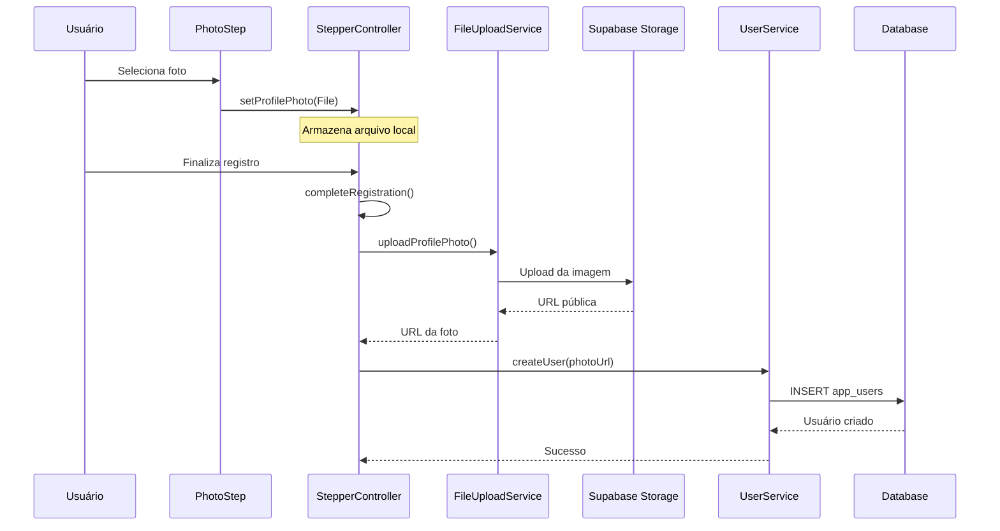

# Relatório: Salvamento da Foto de Perfil no Stepper

## Resumo Executivo

Este relatório analisa como está sendo implementado o salvamento da foto de perfil no processo de registro do usuário (stepper) na aplicação Option v4.1.

## Fluxo Atual de Salvamento da Foto

### 1. Seleção da Foto (PhotoStep)

**Arquivo:** `lib/screens/stepper/photo_step.dart`

- **Método:** `_pickImage(ImageSource source)`
- **Funcionalidade:**
  - Utiliza `ImagePicker` para capturar/selecionar foto
  - Configura qualidade (85%) e dimensões máximas (800x800)
  - Armazena o arquivo localmente no `StepperController`
  - **NÃO faz upload imediato** - apenas salva o `File` local

```dart
final controller = Provider.of<StepperController>(context, listen: false);
controller.setProfilePhoto(File(image.path));
```

### 2. Gerenciamento no StepperController

**Arquivo:** `lib/controllers/stepper_controller.dart`

#### Armazenamento Local
- **Variável:** `File? _profilePhoto` - armazena o arquivo local
- **Variável:** `String? _uploadedPhotoUrl` - armazena a URL após upload
- **Variável:** `String? _uploadedPhotoPath` - armazena o caminho no Storage

#### Upload da Foto
- **Método:** `uploadProfilePhoto()`
- **Quando é executado:** Durante `completeRegistration()`
- **Processo:**
  1. Valida se há foto selecionada
  2. Autentica o usuário
  3. Remove foto anterior se existir
  4. Gera caminho único no Storage
  5. Faz upload via `FileUploadService`
  6. Retorna URL pública

```dart
final photoUrl = await FileUploadService.uploadImage(
  file: _profilePhoto!,
  bucket: 'user-photos',
  path: storagePath,
);
```

### 3. Upload para Supabase Storage (FileUploadService)

**Arquivo:** `lib/services/file_upload_service.dart`

#### Configurações de Upload
- **Bucket:** `user-photos`
- **Tamanho máximo:** 5MB
- **Tipos permitidos:** JPEG, JPG, PNG, WEBP
- **Compressão:** Automática (qualidade 85%, max 1920x1920)
- **Caminho:** `users/{userId}/profile/{timestamp}_{microsecond}.{ext}`

#### Processo de Upload
1. **Validação:** Existência, tamanho, tipo MIME
2. **Compressão:** Redimensiona e comprime se necessário
3. **Upload:** Envia para Supabase Storage com `upsert: true`
4. **URL Pública:** Gera e retorna URL acessível

### 4. Salvamento no Banco de Dados (UserService)

**Arquivo:** `lib/services/user_service.dart`

#### Criação de Usuário
- **Método:** `createUser()`
- **Campo:** `photo_url` na tabela `app_users`
- **Processo:** Salva a URL retornada pelo upload

```dart
final userData = {
  'id': authUserId,
  'email': email,
  'full_name': fullName,
  'phone': finalPhone,
  'photo_url': photoUrl,  // URL do Supabase Storage
  'user_type': userType,
  'status': 'active',
};
```

#### Atualização de Usuário
- **Método:** `updateUser()`
- **Funcionalidade:** Permite atualizar `photo_url` para usuários existentes

## Fluxo Completo do Processo



## Pontos Importantes

### ✅ Funcionalidades Implementadas

1. **Upload Seguro:** Validação de tipo, tamanho e compressão automática
2. **Armazenamento Eficiente:** Compressão e redimensionamento automático
3. **Caminhos Únicos:** Evita conflitos com timestamps únicos
4. **Cleanup:** Remove fotos anteriores ao fazer novo upload
5. **Tratamento de Erros:** Continua registro mesmo se upload falhar
6. **URLs Públicas:** Gera URLs acessíveis para exibição

### ⚠️ Comportamentos Específicos

1. **Upload Tardio:** A foto só é enviada durante `completeRegistration()`
2. **Opcional:** O registro continua mesmo se o upload da foto falhar
3. **Substituição:** Novas fotos substituem as anteriores automaticamente
4. **Persistência:** Estado da foto é mantido durante navegação no stepper

### 🔧 Configuração do Bucket

- **Nome:** `user-photos`
- **Políticas:** Configuradas para permitir upload anônimo e acesso público
- **Estrutura:** `users/{userId}/profile/{arquivo_único}`

## Validação dos Testes

Conforme relatórios anteriores:
- ✅ Upload com chave anônima: **Funcionando**
- ✅ Upload com chave de serviço: **Funcionando**
- ✅ URLs públicas: **Funcionando**
- ✅ Tipos MIME suportados: **JPEG, PNG, WEBP**
- ⚠️ Listagem de arquivos: **Falhando** (não afeta funcionalidade)

## Conclusão

O sistema de salvamento de foto de perfil no stepper está **funcionalmente completo e operacional**. A implementação segue boas práticas de:

- **Segurança:** Validação rigorosa de arquivos
- **Performance:** Compressão automática
- **Usabilidade:** Processo transparente para o usuário
- **Robustez:** Tratamento de erros e fallbacks

O fluxo está pronto para produção e integrado corretamente com o banco de dados através da coluna `photo_url` na tabela `app_users`.

---

**Data do Relatório:** $(date)
**Versão Analisada:** Option v4.1
**Status:** ✅ Funcional e Pronto para Produção