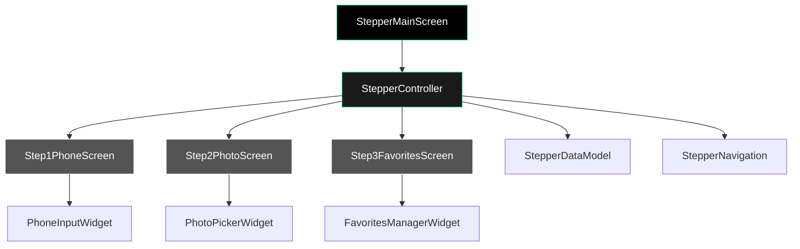

# Arquitetura do Stepper de 3 Telas - Uber Clone

## Visão Geral
Sistema de stepper de 3 telas para onboarding de novos usuários, seguindo o tema preto do Uber.

## Arquitetura

### Diagrama de Fluxo


### Estrutura de Arquivos

```
lib/
├── screens/
│   └── stepper/
│       ├── stepper_main_screen.dart          # Tela principal do stepper
│       ├── steps/
│       │   ├── step1_phone_screen.dart       # Tela 1: Telefone
│       │   ├── step2_photo_screen.dart       # Tela 2: Foto de perfil
│       │   └── step3_favorites_screen.dart   # Tela 3: Locais favoritos
│       └── widgets/
│           ├── stepper_progress_bar.dart     # Barra de progresso
│           ├── stepper_navigation.dart       # Botões avançar/voltar
│           └── stepper_scaffold.dart         # Scaffold base
├── models/
│   └── stepper_data.dart                   # Modelo de dados do stepper
├── controllers/
│   └── stepper_controller.dart             # Gerenciamento de estado
└── widgets/
    └── stepper/
        ├── phone_input_widget.dart         # Input de telefone com máscara
        ├── photo_picker_widget.dart        # Seletor de foto
        └── favorites_manager_widget.dart   # Gerenciador de favoritos
```

## Definições de Classes

### 1. Modelo de Dados - `lib/models/stepper_data.dart`
```dart
class StepperData {
  final String? phoneNumber;
  final String? profilePhotoPath;
  final List<FavoriteLocation> favoriteLocations;
  
  StepperData({
    this.phoneNumber,
    this.profilePhotoPath,
    this.favoriteLocations = const [],
  });
  
  StepperData copyWith({
    String? phoneNumber,
    String? profilePhotoPath,
    List<FavoriteLocation>? favoriteLocations,
  }) {
    return StepperData(
      phoneNumber: phoneNumber ?? this.phoneNumber,
      profilePhotoPath: profilePhotoPath ?? this.profilePhotoPath,
      favoriteLocations: favoriteLocations ?? this.favoriteLocations,
    );
  }
}

class FavoriteLocation {
  final String id;
  final String name;
  final String address;
  final double latitude;
  final double longitude;
  
  FavoriteLocation({
    required this.id,
    required this.name,
    required this.address,
    required this.latitude,
    required this.longitude,
  });
}
```

### 2. Controller - `lib/controllers/stepper_controller.dart`
```dart
import 'package:flutter/material.dart';
import '../models/stepper_data.dart';

class StepperController extends ChangeNotifier {
  int _currentStep = 0;
  StepperData _data = StepperData();
  
  int get currentStep => _currentStep;
  StepperData get data => _data;
  
  void nextStep() {
    if (_currentStep < 2) {
      _currentStep++;
      notifyListeners();
    }
  }
  
  void previousStep() {
    if (_currentStep > 0) {
      _currentStep--;
      notifyListeners();
    }
  }
  
  void goToStep(int step) {
    if (step >= 0 && step <= 2) {
      _currentStep = step;
      notifyListeners();
    }
  }
  
  void updateData(StepperData newData) {
    _data = newData;
    notifyListeners();
  }
  
  void completeStepper() {
    // Lógica para completar o onboarding
  }
}
```

### 3. Tela Principal - `lib/screens/stepper/stepper_main_screen.dart`
```dart
import 'package:flutter/material.dart';
import 'package:provider/provider.dart';
import '../../controllers/stepper_controller.dart';
import 'steps/step1_phone_screen.dart';
import 'steps/step2_photo_screen.dart';
import 'steps/step3_favorites_screen.dart';
import 'widgets/stepper_progress_bar.dart';

class StepperMainScreen extends StatelessWidget {
  const StepperMainScreen({Key? key}) : super(key: key);

  @override
  Widget build(BuildContext context) {
    return ChangeNotifierProvider(
      create: (_) => StepperController(),
      child: Scaffold(
        backgroundColor: AppTheme.uberBlack,
        body: Column(
          children: [
            const StepperProgressBar(),
            Expanded(
              child: Consumer<StepperController>(
                builder: (context, controller, _) {
                  return IndexedStack(
                    index: controller.currentStep,
                    children: const [
                      Step1PhoneScreen(),
                      Step2PhotoScreen(),
                      Step3FavoritesScreen(),
                    ],
                  );
                },
              ),
            ),
          ],
        ),
      ),
    );
  }
}
```

### 4. Tela 1 - Telefone - `lib/screens/stepper/steps/step1_phone_screen.dart`
```dart
class Step1PhoneScreen extends StatelessWidget {
  const Step1PhoneScreen({Key? key}) : super(key: key);

  @override
  Widget build(BuildContext context) {
    return StepperScaffold(
      title: 'Número de Telefone',
      subtitle: 'Precisamos do seu número para verificar sua conta',
      child: PhoneInputWidget(
        onPhoneChanged: (phone) {
          // Atualizar dados
        },
      ),
    );
  }
}
```

### 5. Tela 2 - Foto - `lib/screens/stepper/steps/step2_photo_screen.dart`
```dart
class Step2PhotoScreen extends StatelessWidget {
  const Step2PhotoScreen({Key? key}) : super(key: key);

  @override
  Widget build(BuildContext context) {
    return StepperScaffold(
      title: 'Foto de Perfil',
      subtitle: 'Adicione uma foto para personalizar sua conta',
      child: PhotoPickerWidget(
        onPhotoSelected: (photoPath) {
          // Atualizar dados
        },
      ),
    );
  }
}
```

### 6. Tela 3 - Favoritos - `lib/screens/stepper/steps/step3_favorites_screen.dart`
```dart
class Step3FavoritesScreen extends StatelessWidget {
  const Step3FavoritesScreen({Key? key}) : super(key: key);

  @override
  Widget build(BuildContext context) {
    return StepperScaffold(
      title: 'Locais Favoritos',
      subtitle: 'Adicione seus lugares frequentes para viagens mais rápidas',
      child: FavoritesManagerWidget(
        onFavoritesChanged: (favorites) {
          // Atualizar dados
        },
      ),
    );
  }
}
```

### 7. Widget de Input de Telefone - `lib/widgets/stepper/phone_input_widget.dart`
```dart
class PhoneInputWidget extends StatefulWidget {
  final Function(String) onPhoneChanged;
  
  const PhoneInputWidget({
    Key? key,
    required this.onPhoneChanged,
  }) : super(key: key);

  @override
  State<PhoneInputWidget> createState() => _PhoneInputWidgetState();
}

class _PhoneInputWidgetState extends State<PhoneInputWidget> {
  final _controller = TextEditingController();
  
  @override
  Widget build(BuildContext context) {
    return TextField(
      controller: _controller,
      keyboardType: TextInputType.phone,
      inputFormatters: [
        FilteringTextInputFormatter.digitsOnly,
        TelefoneInputFormatter(),
      ],
      decoration: const InputDecoration(
        hintText: '(00) 0 0000-0000',
        prefixIcon: Icon(Icons.phone, color: AppTheme.uberGreen),
      ),
      onChanged: widget.onPhoneChanged,
    );
  }
}
```

### 8. Formatter de Telefone Brasileiro
```dart
class TelefoneInputFormatter extends TextInputFormatter {
  @override
  TextEditingValue formatEditUpdate(
    TextEditingValue oldValue,
    TextEditingValue newValue,
  ) {
    final text = newValue.text.replaceAll(RegExp(r'[^\d]'), '');
    
    if (text.length <= 2) {
      return TextEditingValue(
        text: text.isEmpty ? '' : '($text',
        selection: TextSelection.collapsed(offset: text.length + 1),
      );
    } else if (text.length <= 3) {
      return TextEditingValue(
        text: '(${text.substring(0, 2)}) ${text.substring(2)}',
        selection: TextSelection.collapsed(offset: text.length + 4),
      );
    } else if (text.length <= 7) {
      return TextEditingValue(
        text: '(${text.substring(0, 2)}) ${text.substring(2, 3)} ${text.substring(3)}',
        selection: TextSelection.collapsed(offset: text.length + 5),
      );
    } else if (text.length <= 11) {
      return TextEditingValue(
        text: '(${text.substring(0, 2)}) ${text.substring(2, 3)} ${text.substring(3, 7)}-${text.substring(7)}',
        selection: TextSelection.collapsed(offset: text.length + 6),
      );
    } else {
      return TextEditingValue(
        text: '(${text.substring(0, 2)}) ${text.substring(2, 3)} ${text.substring(3, 7)}-${text.substring(7, 11)}',
        selection: TextSelection.collapsed(offset: 17),
      );
    }
  }
}
```

## Integração com Tema Existente

O stepper utilizará o tema preto do Uber já definido:
- Background: `AppTheme.uberBlack`
- Textos: `AppTheme.uberWhite`
- Acentos: `AppTheme.uberGreen`
- Inputs: Seguir o padrão do tema existente

## Próximos Passos

1. Implementar a estrutura de arquivos conforme definido
2. Criar os widgets básicos com placeholders
3. Implementar navegação entre steps
4. Adicionar validações básicas
5. Integrar com o tema do Uber

## Observações

- A estrutura é modular e pode ser facilmente estendida
- O gerenciamento de estado usa ChangeNotifier para simplicidade
- Os widgets são reutilizáveis e testáveis
- A máscara de telefone segue o padrão brasileiro (##) # ####-####