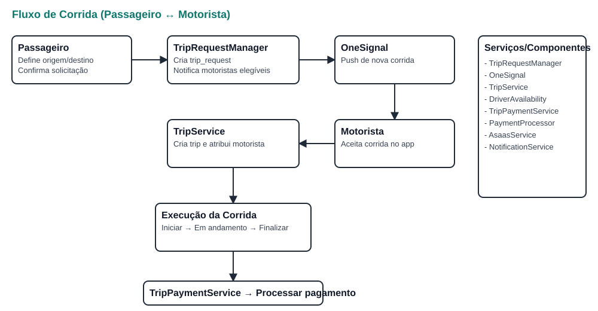
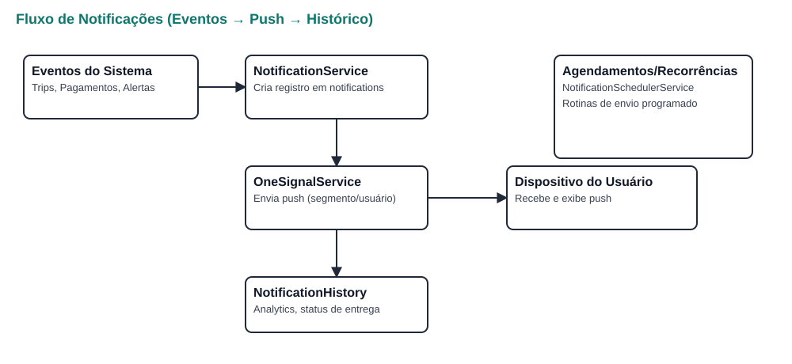
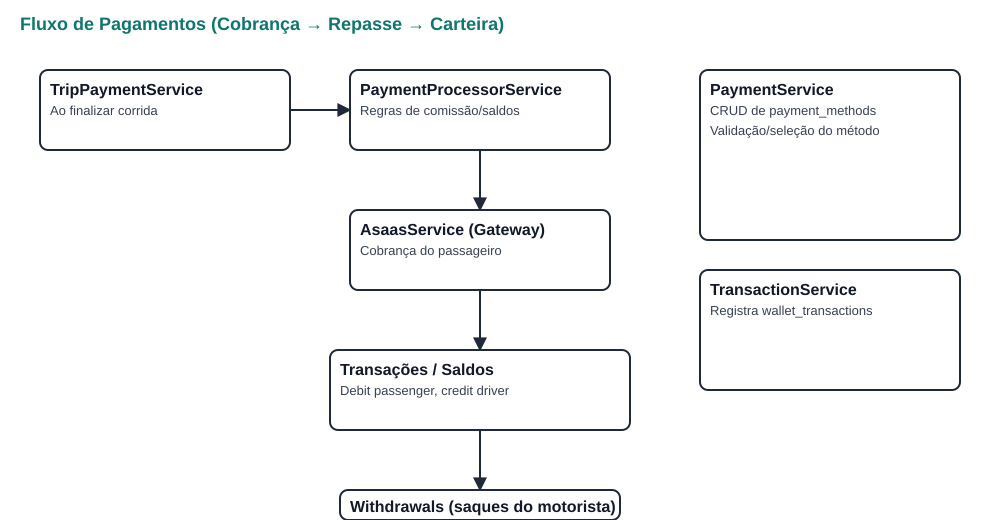
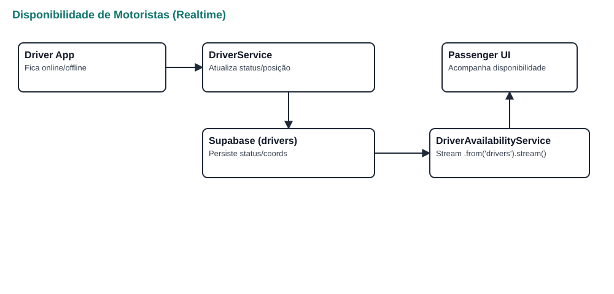
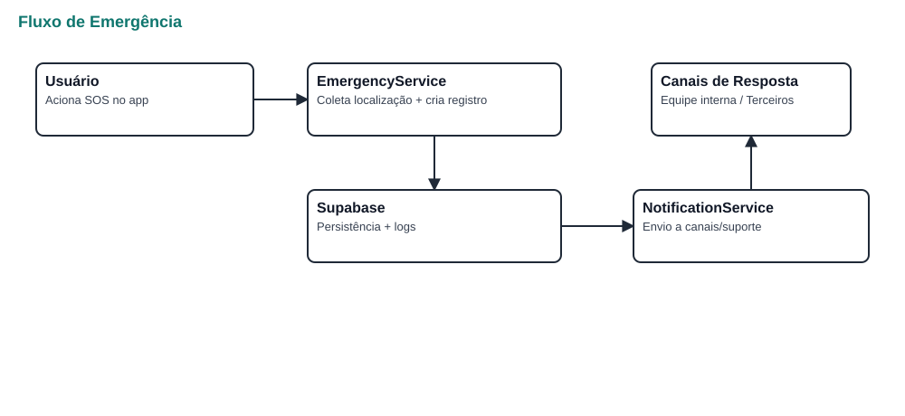
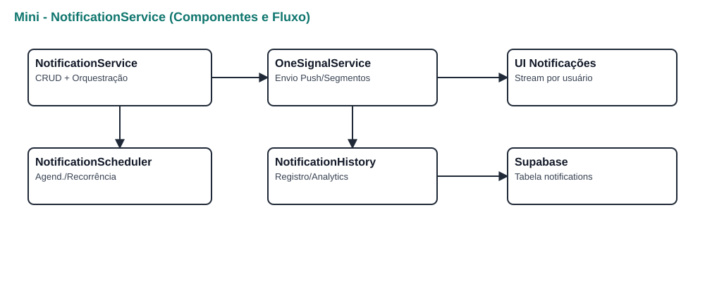

# Documentação Operacional do Aplicativo

Última atualização: gerar automaticamente a partir do código-fonte atual.

Sumário
- [0) Visão Geral](#sec-0)
- [1) Processos Principais](#sec-1)
  - [1.1 Autenticação e Sessão](#sec-1-1)
  - [1.2 Disponibilidade de Motoristas (Realtime)](#sec-1-2)
  - [1.3 Solicitação/Matching de Corridas](#sec-1-3)
  - [1.4 Execução da Corrida](#sec-1-4)
  - [1.5 Pagamentos (Cobrança, Repasses e Carteira)](#sec-1-5)
  - [1.6 Notificações (Push, Locais, Agendadas, Recorrentes)](#sec-1-6)
  - [1.7 Favoritos/Locais Salvos](#sec-1-7)
  - [1.8 Emergência e Segurança](#sec-1-8)
  - [1.9 Observabilidade (Logs/Alertas)](#sec-1-9)
  - [1.10 Integridade de Dados e Concorrência](#sec-1-10)
- [2) Interações entre Componentes](#sec-2)
- [3) Sequências de Ações do Usuário (Jornadas)](#sec-3)
- [4) Requisitos de Documentação](#sec-4)
- [5) Políticas Arquiteturais](#sec-5)
- [6) Checklist de Qualidade](#sec-6)
- [7) Tabelas do Supabase e Campos Usados](#sec-7)
- [8) Diagramas dos Fluxos](#sec-8)
- [9) Glossário](#sec-9)

0) Visão Geral
- Plataforma: Flutter + Supabase (Auth, DB, Realtime) + OneSignal (push).
- Camadas: UI (screens) → Controllers → Services → Infra (Supabase/OneSignal/pagamentos) → Observabilidade.
- Boot: Supabase + OneSignal inicializados em `lib/main.dart` (função main).

1) Processos Principais

1.1 Autenticação e Sessão
- Objetivo: autenticar e expor `currentUser` e `SupabaseClient` para serviços.
- Requisitos: SUPABASE_URL/ANON_KEY válidos, rede ativa.
- Entradas/Saídas: credenciais → sessão ativa; `userId` disponível.
- Implementação: `lib/main.dart`; uso em controllers (ex.: `lib/controllers/saved_places_controller.dart`).
- Exceções: falha de init; usuário não autenticado.

1.2 Disponibilidade de Motoristas (Realtime)
- Objetivo: acompanhar status online/aprovação, viagens ativas e requests pendentes.
- Requisitos: tabelas `drivers`, `trips`, `trip_requests` e Realtime.
- Saída: stream consolidada de disponibilidade por motorista.
- Implementação: `lib/services/driver_availability_service.dart` (streams em `from(...).stream(...)`).
- Diagrama correspondente: ver seção 8.4.

1.3 Solicitação/Matching de Corridas
- Objetivo: gerenciar do pedido do passageiro até o aceite do motorista.
- Requisitos: passageiro autenticado; motoristas elegíveis.
- Saída: trip criada/atribuída; notificações enviadas.
- Implementação: `lib/services/trip_request_manager.dart` + `driver_service.dart`/`driver_matching_service.dart`/`trip_service.dart`.
- Diagrama correspondente: ver seção 8.1.

1.4 Execução da Corrida
- Objetivo: iniciar/atualizar/finalizar corrida, com status e métricas.
- Requisitos: corrida aceita.
- Saída: status persistido; tarifa final calculada.
- Implementação: `lib/services/trip_service.dart` (atualizações + realtime quando aplicável).

1.5 Pagamentos (Cobrança, Repasses e Carteira)
- Objetivo: cobrar passageiro; repassar motorista; aplicar comissão.
- Requisitos: método de pagamento ativo; integrações configuradas.
- Saída: lançamentos de débito/crédito; saldos atualizados.
- Implementação: `lib/services/payment_processor_service.dart`, `trip_payment_service.dart`, `payment_service.dart`, `asaas_service.dart`.
- Diagrama correspondente: ver seção 8.3.

1.6 Notificações (Push, Locais, Agendadas, Recorrentes)
- Objetivo: avisar eventos (corridas, status, sistema) e registrar histórico.
- Requisitos: OneSignal inicializado; permissões.
- Saída: notificações entregues + histórico/analytics.
- Implementação: `lib/services/notification_service.dart` (CRUD/stream), `onesignal_service.dart` (envio/segmentos), `notification_scheduler_service.dart` (agend./recorr.), `notification_history_service.dart` (analytics). SQL: `sql/onesignal_schema_setup.sql`.
- Diagrama correspondente: ver seção 8.2.

1.7 Favoritos/Locais Salvos
- Objetivo: CRUD de locais do usuário e reuso em corridas.
- Implementação: `lib/controllers/saved_places_controller.dart` + `lib/services/favorite_locations_service.dart`.

1.8 Emergência e Segurança
- Objetivo: acionar fluxo de emergência (localização, aviso, registro).
- Implementação: `lib/services/emergency_service.dart`.
- Diagrama correspondente: ver seção 8.5.

1.9 Observabilidade (Logs/Alertas)
- Objetivo: métricas, alertas e logs centralizados.
- Implementação: `lib/services/alert_service.dart`, `lib/core/error_handling/error_logger.dart` (logs no Supabase).

1.10 Integridade de Dados e Concorrência
- Objetivo: garantir consistência sem transações explícitas no cliente.
- Estratégia: validações, controle de concorrência, retries com backoff.
- Implementação: `lib/services/transaction_service.dart`, `lib/services/data_integrity_service.dart`.

2) Interações entre Componentes
- Fluxo de dependências: Screens → Controllers → Services → (Supabase/OneSignal/Gateway) → Observabilidade.
- Supabase: select/insert/update via `from('tabela')...`; Realtime via `.stream(primaryKey: ...)` (ex.: driver availability e notifications).
- OneSignal: registro/envio/segmentação via `lib/services/onesignal_service.dart`. Agendamentos/recorrências via `notification_scheduler_service.dart`.
- Pagamentos: métodos (`payment_service.dart`), processamento por corrida (`trip_payment_service.dart`), regras/saldos (`payment_processor_service.dart`), gateway (`asaas_service.dart`).
- Observabilidade: erros → `error_logger.dart`; alertas → `alert_service.dart`; integridade → `data_integrity_service.dart`.

3) Sequências de Ações do Usuário

3.1 Passageiro: Solicitar Corrida (típico)
1) Autentica e define origem/destino (pode usar locais salvos).
2) Confirma solicitação → `trip_request_manager.dart` cria request e notifica motoristas.
3) Aguarda aceite; UI acompanha disponibilidade (`driver_availability_service.dart`).
4) Ao aceite, cria/atribui `trip` e notifica.
5) Condução e finalização; pagamento processado (`trip_payment_service.dart`).
- Exceções: sem motoristas (timeout), cancelamentos (possível taxa em `cancellation_fee_service.dart`), falha de pagamento (reprocesso/alternativa).

3.2 Motorista: Atender Corrida (típico)
1) Fica online (`driver_service.dart`).
2) Recebe push (OneSignal) e aceita no app (`trip_request_manager.dart`).
3) Navega, inicia, conduz, encerra; recebe repasse.
- Exceções: corrida expirada; falhas de rede/localização.

3.3 Notificações do Usuário
1) App registra token no OneSignal.
2) Eventos geram criação em `notifications` e envio push (`notification_service.dart` + `onesignal_service.dart`).
3) Tela consome stream por usuário (`lib/screens/notifications/notifications_screen.dart`).
- Exceções: push desabilitado (fallback local/inbox); falhas de envio (histórico e retry).

3.4 Métodos de Pagamento
1) Lista métodos ativos (`payment_service.dart`).
2) Adiciona/remove/define padrão.
- Exceções: método inválido/expirado; indisponibilidade do gateway.

3.5 Emergência
1) Usuário aciona; coleta localização e registra (`emergency_service.dart`).
2) Notifica canais apropriados (quando configurado).

3.6 Locais Salvos
1) CRUD via controller/serviço; reuso nos fluxos de corrida.

4) Requisitos de Documentação
- Linguagem clara e objetiva; estrutura hierárquica por processo.
- Diagramas/fluxos: representar sequências acima conforme necessário nos materiais de apoio.
- Terminologia consistente: trip_request, trip, notification, payment_method, wallet, realtime/stream, scheduler/segmentação.

5) Políticas Arquiteturais
- Sem RLS e sem Functions no Supabase (política do projeto).
- Triggers apenas quando estritamente necessário e sempre bem documentadas.
- Segurança de segredos: não logar chaves; configurar por ambiente.
- Resiliência: retries com backoff; cache local para consistência percebida.

6) Checklist de Qualidade
- Cobrir: autenticação, disponibilidade, matching, execução, pagamentos, notificações, favoritos, emergência, observabilidade, integridade.
- Interações entre componentes e integrações externas mapeadas.
- Jornadas típicas e excepcionais descritas.
- Terminologia consistente; referências a arquivos-chave.
- Aderência às políticas (sem RLS/Functions; triggers documentadas).

7) Tabelas do Supabase e Campos Usados

Esta seção cruza os processos principais com as tabelas relevantes documentadas em [SUPABASE_TABLES.md](SUPABASE_TABLES.md), enfatizando a política do projeto: sem RLS e sem Functions no Supabase; Triggers apenas quando estritamente necessárias e bem documentadas.

- Disponibilidade de Motoristas (Realtime)
  - Tabelas: `drivers` (campos chave: `status`, `is_online`, `lat`, `lng`, `updated_at`), `driver_schedules`, `available_drivers_view`.
  - Observações: streams por chave primária; atualização periódica de localização/status no app do motorista.

- Emergência e Segurança (SOS)
  - Tabelas: `activity_logs` (registro do evento SOS), `notifications` (alerta a canais), `app_users` (vínculo do usuário), `trips` (quando SOS ocorre durante corrida).
  - Observações: incluir metadata de geolocalização (lat/lng, precisão, timestamp) no registro de SOS; acionar fluxo de notificação.

- Autenticação e Sessão
  - Tabelas: `app_users`, `profiles`, `user_devices`.
  - Observações: associação com `auth.users` via `app_users.user_id`.

- Disponibilidade de Motoristas (Realtime)
  - Tabelas: `drivers`, `driver_schedules`, `available_drivers_view` (view de suporte).
  - Observações: status/locais e janelas de disponibilidade.

- Solicitação/Matching de Corridas
  - Tabelas: `trip_requests`, `driver_offers`.
  - Observações: pedidos abertos e respostas/aceites dos motoristas.

- Execução da Corrida
  - Tabelas: `trips`, `trip_status_history`, `trip_location_history`, `trip_chats`.
  - Observações: campos financeiros em `trips` (base_fare, total_fare, driver_earnings, platform_commission...).

- Pagamentos (Cobrança, Repasses e Carteira)
  - Tabelas: `driver_wallets`, `wallet_transactions`, `withdrawals`, `trips` (campos financeiros), `platform_settings` (parâmetros de comissão/limites quando aplicável).
  - Observações: as regras de comissão e distribuição são aplicadas no serviço, com registro em `wallet_transactions` e atualização de saldos.

- Notificações
  - Tabelas: `notifications`, `user_devices`.
  - Observações: histórico, status e analytics; correlação com eventos de trips/pagamentos.

- Favoritos/Locais Salvos
  - Tabelas: `saved_places`.

- Emergência e Segurança
  - Tabelas: uso de `activity_logs` e `notifications` para registros/alertas vinculados.

- Observabilidade
  - Tabelas: `activity_logs`, `daily_statistics`, `platform_settings` (toggles/limiares quando aplicável).

Referência rápida de relacionamentos chave (ver detalhes completos em SUPABASE_TABLES.md): `app_users` ↔ `drivers`/`passengers`; `passengers` ↔ `trip_requests`; `drivers` ↔ `driver_offers`; `trips` ↔ (`passengers`, `drivers`) e históricos.

8) Diagramas dos Fluxos

8.1 Fluxo de Corrida

8.2 Fluxo de Notificações

8.3 Fluxo de Pagamentos

8.4 Disponibilidade de Motoristas (Realtime)

8.5 Fluxo de Emergência

8.6 Mini - NotificationService (Componentes)

9) Glossário

- app_users: tabela principal de usuários do app; relaciona com auth.users via user_id.
- passengers / drivers: perfis específicos para passageiro e motorista.
- trip_request: pedido de corrida do passageiro antes de haver motorista atribuído.
- driver_offer: resposta de um motorista a um trip_request (aceite/recusa/expiração).
- trip: corrida em si, do aceite à finalização, com status, timestamps e valores.
- trip_status_history: histórico detalhado das mudanças de status da trip.
- trip_location_history: trilhas de GPS durante a trip (amostragem periódica).
- trip_chats: mensagens trocadas entre passageiro e motorista durante uma trip.
- available_drivers_view: visão auxiliar para listar motoristas elegíveis/online.
- driver_schedules: janelas/turnos de operação do motorista.
- notifications: registros de notificações (conteúdo, status de envio, metadata).
- user_devices: dispositivos do usuário (tokens OneSignal, plataforma, versão).
- scheduler (notificações): lógica de agendamento/recorrência para envios futuros.
- segmentação (OneSignal): agrupamento de usuários/dispositivos por atributos para envio direcionado.
- realtime / stream: assinaturas de atualização em tempo real (Supabase) sobre tabelas/vistas.
- emergency / SOS: fluxo de emergência acionado no app (registro, localização e alertas).
- activity_logs: trilha de auditoria/atividades relevantes do sistema/usuário.
- daily_statistics: agregados diários para acompanhamento de métricas.
- payment_method: método de pagamento ativo do passageiro.
- trip_payment: processo de cobrança de uma trip (do cálculo ao gateway e registro).
- asaas (gateway): serviço/gateway externo utilizado para processamento de pagamentos.
- driver_wallet: carteira do motorista (saldo disponível/pendente).
- wallet_transactions: lançamentos de crédito/débito na carteira (com referência de origem).
- withdrawals: solicitações de saque do motorista.
- platform_commission: comissão da plataforma aplicada sobre a trip.
- driver_earnings: valor líquido do motorista após comissões/ajustes.
- base_fare / total_fare: tarifa base e valor total cobrado na trip.
- cancellation_fee: taxa cobrada em cancelamentos dependendo das regras vigentes.
- platform_settings: parâmetros de configuração (ex.: percentuais, limites, toggles).
- saved_places: locais salvos pelo usuário (Casa, Trabalho, etc.).
- operational_cities: cidades em que a plataforma opera.
- driver_operational_cities: cidades onde um motorista pode atuar.
- ratings: avaliações e comentários pós-corrida.
- integridade de dados: práticas para manter consistência (idempotência, concorrência controlada, retries exponenciais).
- trigger (DB): lógica executada no banco em eventos (INSERT/UPDATE/DELETE); usar somente quando necessário e sempre bem documentada.
- RLS (Row Level Security): controle de acesso por linha; política do projeto: não utilizar.
- Function (RPC): função armazenada no banco; política do projeto: não utilizar.