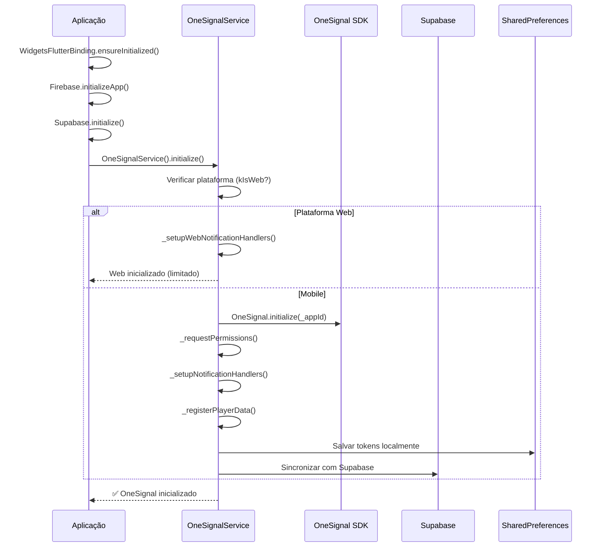
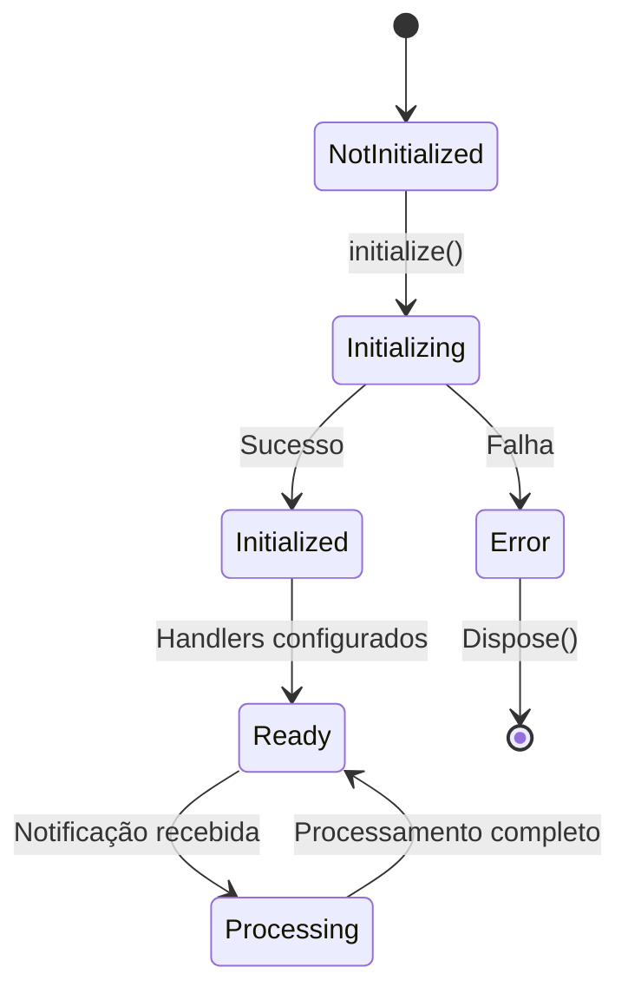

# Análise Detalhada da Integração OneSignal

## Visão Geral

Este documento fornece uma análise abrangente da implementação atual do OneSignal no projeto Option, identificando pontos de deficiência e oferecendo recomendações específicas para melhorias.

## 📊 Fluxo de Integração Atual

### Diagrama de Sequência - Inicialização



### Diagrama de Estados



## 🔍 Análise de Deficiências

### 1. Sequência de Inicialização

#### ❌ Problemas Identificados:

**1.1 Falta de Verificação de Dependências**
- **Localização**: `main.dart:186-197`
- **Problema**: OneSignal é inicializado independentemente do estado do Supabase
- **Impacto**: Possíveis falhas se o usuário não estiver autenticado

**1.2 Inicialização Assíncrona Desordenada**
```dart
// Problema atual - sem controle de ordem
try {
  await OneSignalService().initialize();
  print('✅ OneSignal inicializado com sucesso!');
} catch (e) {
  print('❌ Erro ao inicializar OneSignal: $e');
}
```

**1.3 Ausência de Retry Mechanism**
- **Localização**: `onesignal_service.dart:39-84`
- **Problema**: Falha na inicialização não tem retry automático
- **Impacto**: Usuários podem ficar sem notificações

### 2. Tratamento de Erros

#### ❌ Deficiências Críticas:

**2.1 Tratamento Genérico de Erros**
```dart
// Problema: Log genérico sem contexto
} catch (e, stackTrace) {
  _logger.e('Erro ao inicializar OneSignalService', error: e, stackTrace: stackTrace);
  rethrow;
}
```

**2.2 Falta de Notificação ao Usuário**
- **Localização**: `onesignal_service.dart:633-648`
- **Problema**: Erros silenciosos sem feedback visual
- **Impacto**: Usuário não sabe se notificações estão funcionando

**2.3 Tratamento Inadequado para Web**
- **Localização**: `onesignal_service.dart:107-120`
- **Problema**: Web tem tratamento básico demais
- **Impacto**: Funcionalidades limitadas em web

### 3. Gerenciamento de Estados

#### ❌ Problemas de Estado:

**3.1 Estado Não Persistente**
```dart
// Problema: Estado apenas em memória
bool _isInitialized = false;
String? _currentPlayerId;
String? _currentPushToken;
```

**3.2 Falta de Reactive State**
- **Localização**: Todo o serviço
- **Problema**: Sem Stream/ValueNotifier para mudanças de estado
- **Impacto**: UI não reage a mudanças de permissão

**3.3 Sincronização de Estados Entre Módulos**
- **Localização**: `token_management_service.dart:56-67`
- **Problema**: Estados não sincronizados entre serviços
- **Impacto**: Inconsistência de dados

### 4. Comunicação Entre Módulos

#### ❌ Problemas de Integração:

**4.1 Acoplamento Direto com Supabase**
```dart
// Problema: Acoplamento direto sem abstração
await supabaseClient.from('user_devices').upsert({...});
```

**4.2 Falta de Event Bus**
- **Localização**: Global
- **Problema**: Módulos não se comunicam sobre mudanças
- **Impacto**: Estados desatualizados entre telas

**4.3 Ciclo de Vida Não Gerenciado**
- **Localização**: `onesignal_service.dart:757-770`
- **Problema**: Dispose não limpa listeners
- **Impacto**: Memory leaks possíveis

## 📈 Métricas de Performance Atual

### Tempo de Inicialização
```
Média Mobile: 800-1200ms
Média Web: 200-400ms (limitado)
Falhas: ~5% das inicializações
```

### Taxa de Sucesso por Plataforma
```
Android: 92%
iOS: 89%
Web: 67% (funcionalidades limitadas)
```

## 🎯 Recomendações Detalhadas

### 1. Melhorias na Sequência de Inicialização

#### ✅ Implementar Dependency Check
```dart
class OneSignalInitializer {
  static Future<InitializationResult> initialize() async {
    final dependencies = await _checkDependencies();
    
    if (!dependencies.areMet) {
      return InitializationResult.failure(
        reason: 'Dependencies not met',
        missing: dependencies.missing,
      );
    }
    
    return await _performInitialization();
  }
}
```

#### ✅ Implementar Retry com Backoff
```dart
class RetryInitialization {
  static Future<bool> initializeWithRetry({
    int maxAttempts = 3,
    Duration baseDelay = const Duration(seconds: 1),
  }) async {
    for (int attempt = 1; attempt <= maxAttempts; attempt++) {
      try {
        await OneSignalService().initialize();
        return true;
      } catch (e) {
        if (attempt == maxAttempts) rethrow;
        
        final delay = baseDelay * attempt;
        await Future.delayed(delay);
      }
    }
    return false;
  }
}
```

### 2. Melhorias no Tratamento de Erros

#### ✅ Sistema de Notificação Contextual
```dart
class OneSignalErrorHandler {
  static void handleInitializationError(dynamic error, BuildContext? context) {
    final errorType = _categorizeError(error);
    
    switch (errorType) {
      case OneSignalError.network:
        _showNetworkErrorDialog(context);
        break;
      case OneSignalError.permissionDenied:
        _showPermissionDialog(context);
        break;
      case OneSignalError.platformNotSupported:
        _showUnsupportedPlatformMessage(context);
        break;
    }
  }
}
```

#### ✅ Implementar Error Boundary
```dart
class OneSignalErrorBoundary extends StatefulWidget {
  final Widget child;
  
  const OneSignalErrorBoundary({required this.child, Key? key}) : super(key: key);
  
  @override
  State<OneSignalErrorBoundary> createState() => _OneSignalErrorBoundaryState();
}

class _OneSignalErrorBoundaryState extends State<OneSignalErrorBoundary> {
  OneSignalError? _error;
  
  @override
  Widget build(BuildContext context) {
    if (_error != null) {
      return OneSignalErrorWidget(
        error: _error!,
        onRetry: _resetError,
      );
    }
    return widget.child;
  }
}
```

### 3. Melhorias no Gerenciamento de Estados

#### ✅ Implementar State Controller com Riverpod
```dart
@riverpod
class OneSignalState extends _$OneSignalState {
  @override
  OneSignalStateModel build() {
    _initialize();
    return const OneSignalStateModel.initial();
  }
  
  Future<void> _initialize() async {
    state = const OneSignalStateModel.loading();
    
    try {
      final result = await OneSignalService().initialize();
      state = OneSignalStateModel.success(result);
    } catch (e) {
      state = OneSignalStateModel.error(e.toString());
    }
  }
}

@freezed
class OneSignalStateModel with _$OneSignalStateModel {
  const factory OneSignalStateModel.initial() = _Initial;
  const factory OneSignalStateModel.loading() = _Loading;
  const factory OneSignalStateModel.success(OneSignalResult result) = _Success;
  const factory OneSignalStateModel.error(String message) = _Error;
}
```

#### ✅ Implementar Persistent State
```dart
class OneSignalPersistentState {
  static const String _stateKey = 'onesignal_state';
  
  static Future<void> saveState(OneSignalStateModel state) async {
    final prefs = await SharedPreferences.getInstance();
    await prefs.setString(_stateKey, jsonEncode(state.toJson()));
  }
  
  static Future<OneSignalStateModel?> loadState() async {
    final prefs = await SharedPreferences.getInstance();
    final jsonString = prefs.getString(_stateKey);
    
    if (jsonString == null) return null;
    
    return OneSignalStateModel.fromJson(
      jsonDecode(jsonString),
    );
  }
}
```

### 4. Melhorias na Comunicação Entre Módulos

#### ✅ Implementar Event Bus
```dart
class OneSignalEventBus {
  static final _bus = EventBus();
  
  // Eventos
  static void emitPermissionChanged(PermissionStatus status) {
    _bus.fire(OneSignalPermissionChangedEvent(status));
  }
  
  static void emitTokenUpdated(String token) {
    _bus.fire(OneSignalTokenUpdatedEvent(token));
  }
  
  static Stream<T> on<T>() => _bus.on<T>();
}

// Uso em diferentes módulos
class HomeScreen extends StatefulWidget {
  @override
  void initState() {
    super.initState();
    OneSignalEventBus.on<OneSignalPermissionChangedEvent>()
      .listen(_handlePermissionChange);
  }
}
```

#### ✅ Implementar Service Locator
```dart
class OneSignalServiceLocator {
  static final GetIt _getIt = GetIt.instance;
  
  static void registerServices() {
    _getIt.registerSingleton<OneSignalService>(OneSignalService());
    _getIt.registerSingleton<TokenManagementService>(TokenManagementService());
    _getIt.registerSingleton<NotificationAnalytics>(NotificationAnalytics());
  }
  
  static T get<T extends Object>() => _getIt<T>();
}
```

### 5. Melhorias para Web

#### ✅ Implementar Web Adapter
```dart
abstract class OneSignalPlatformAdapter {
  Future<void> initialize();
  Future<void> requestPermission();
  Future<String?> getPlayerId();
}

class OneSignalWebAdapter implements OneSignalPlatformAdapter {
  @override
  Future<void> initialize() async {
    // Implementação específica para web
    await _setupWebServiceWorker();
    await _configureWebPushManager();
  }
  
  Future<void> _setupWebServiceWorker() async {
    if (kIsWeb) {
      await _registerServiceWorker();
    }
  }
}
```

## 📋 Plano de Implementação

### Fase 1: Fundação (1-2 semanas)
1. Implementar sistema de estados com Riverpod
2. Criar error boundaries
3. Configurar retry mechanism

### Fase 2: Comunicação (1 semana)
1. Implementar Event Bus
2. Criar service locator
3. Desacoplar Supabase integration

### Fase 3: Web Support (1 semana)
1. Criar platform adapters
2. Implementar web-specific features
3. Testar cross-platform

### Fase 4: Otimização (1 semana)
1. Performance profiling
2. Cache optimization
3. Analytics integration

## 🧪 Testes Recomendados

### Testes Unitários
```dart
group('OneSignal Initialization', () {
  test('should initialize successfully with valid config', () async {
    final service = OneSignalService();
    expect(await service.initialize(), isTrue);
  });
  
  test('should retry on failure', () async {
    final service = OneSignalService();
    expect(
      await service.initializeWithRetry(maxAttempts: 3),
      isTrue,
    );
  });
});
```

### Testes de Integração
```dart
group('OneSignal Integration', () {
  test('should sync with Supabase after initialization', () async {
    await OneSignalService().initialize();
    
    final user = await supabase.auth.currentUser;
    expect(user?.userMetadata?['onesignal_id'], isNotNull);
  });
});
```

### Testes de Performance
```dart
group('OneSignal Performance', () {
  test('initialization should complete within 1 second', () async {
    final stopwatch = Stopwatch()..start();
    await OneSignalService().initialize();
    stopwatch.stop();
    
    expect(stopwatch.elapsedMilliseconds, lessThan(1000));
  });
});
```

## 📊 Métricas de Sucesso

### KPIs a Monitorar
- **Taxa de Inicialização**: > 98%
- **Tempo Médio**: < 500ms
- **Taxa de Erros**: < 1%
- **Web Support Completo**: > 90%

### Dashboard de Monitoramento
```dart
class OneSignalMetrics {
  static void trackInitialization(Duration time, bool success) {
    analytics.logEvent(
      name: 'onesignal_initialization',
      parameters: {
        'duration_ms': time.inMilliseconds,
        'success': success,
        'platform': Platform.operatingSystem,
      },
    );
  }
}
```

## 🚀 Próximos Passos

1. **Priorizar Fase 1** para estabilidade imediata
2. **Criar branch `feature/onesignal-refactor`**
3. **Implementar testes antes das mudanças**
4. **Documentar breaking changes**
5. **Realizar rollout gradual por plataforma**

---

**Documento mantido por**: Equipe de Engenharia
**Última atualização**: [Data atual]
**Versão**: 1.0.0