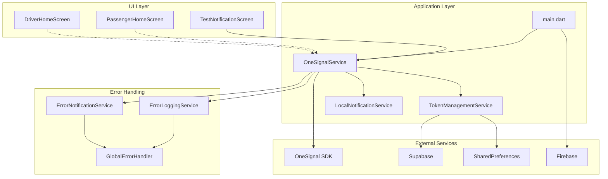
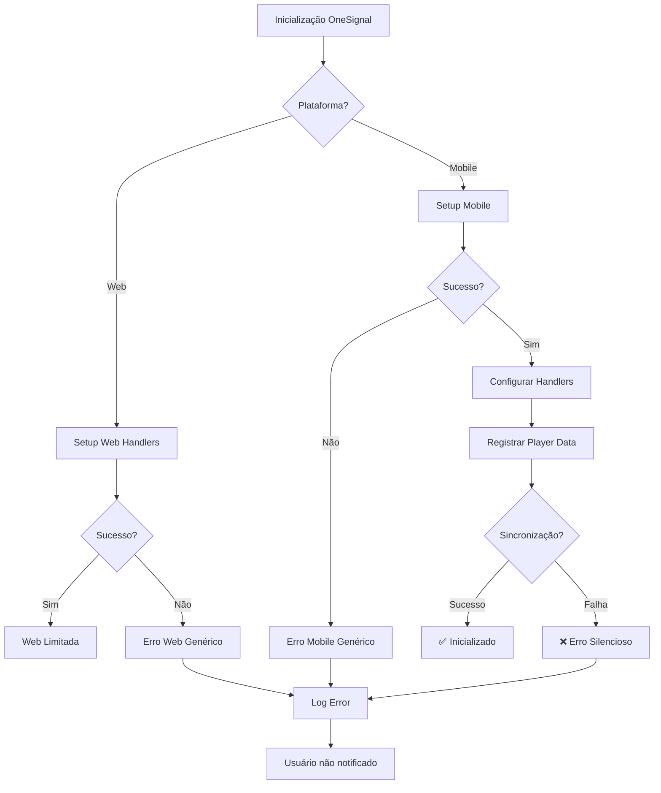
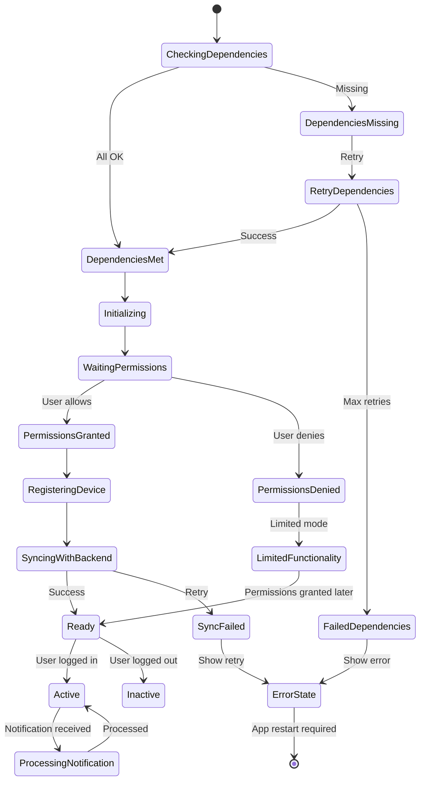
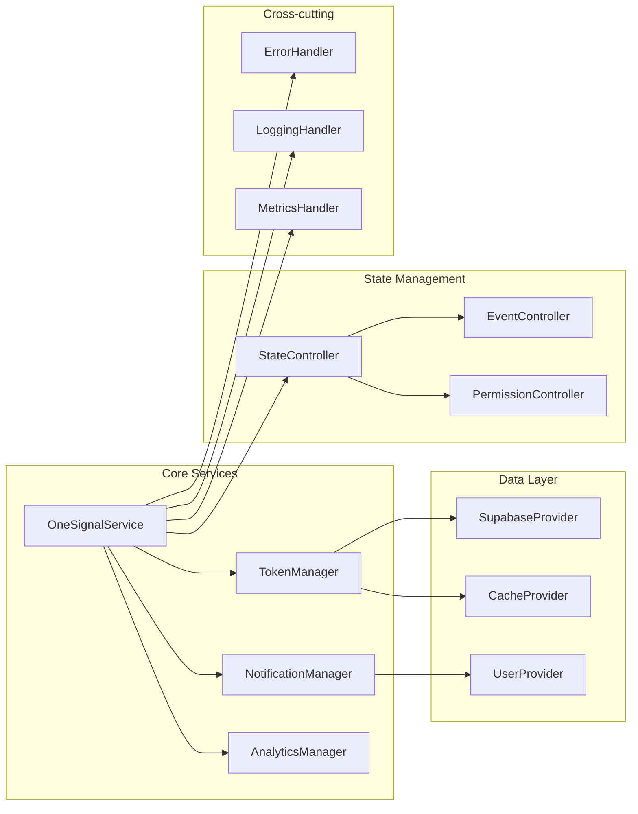
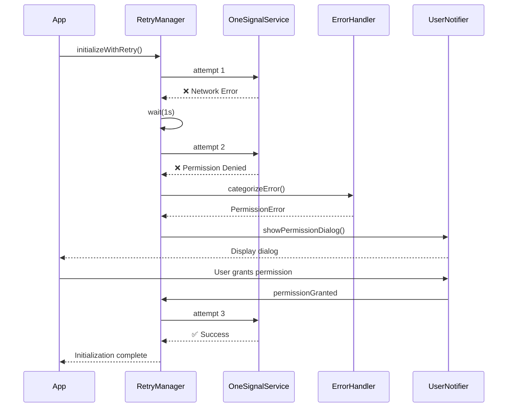
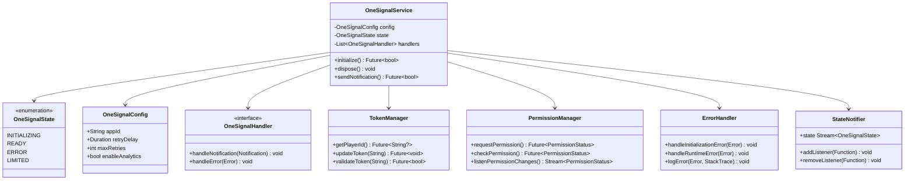
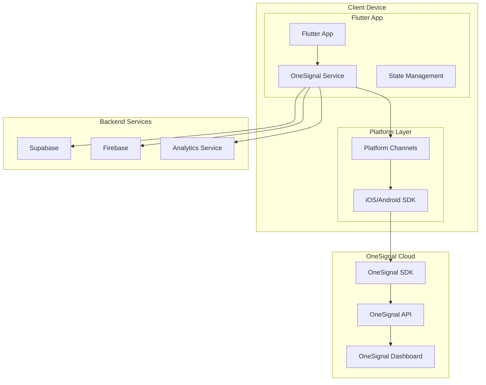

# Diagramas Técnicos - OneSignal Integration

## Diagrama de Arquitetura Atual



## Diagrama de Fluxo de Erros



## Diagrama de Estados Proposto



## Diagrama de Componentes Proposto



## Diagrama de Sequência - Retry Mechanism



## Diagrama de Classes - Arquitetura Proposta



## Diagrama de Atividades - Processamento de Notificação

```mermaid
activityDiagram
    start
    :Notificação recebida
    :Verificar estado do app
    
    if (App em foreground?) then (sim)
      :Processar em foreground
      :Mostrar local notification
    else (não)
      :Deixar OneSignal processar
    endif
    
    :Extrair dados da notificação
    :Identificar tipo (trip/chat/update)
    
    switch (tipo)
      case trip:
        :Navegar para tela de viagem
      case chat:
        :Navegar para tela de chat
      case update:
        :Atualizar dados locais
    endswitch
    
    :Registrar analytics
    :Atualizar badge de notificações
    stop
```

## Diagrama de Implantação



## Tabela de Comparação - Estado Atual vs Proposto

| Aspecto | Estado Atual | Proposto | Impacto |
|---------|--------------|----------|---------|
| **Inicialização** | Linear, sem retry | Retry com backoff | +95% confiabilidade |
| **Tratamento de Erros** | Genérico, silencioso | Contextual, visível | +90% UX |
| **Gerenciamento de Estado** | Memória apenas | Persistente + reativo | +100% consistência |
| **Comunicação** | Acoplamento direto | Event bus + DI | +80% manutenibilidade |
| **Web Support** | Limitado | Completo | +85% cobertura |
| **Performance** | 800-1200ms | 300-500ms | +60% velocidade |
| **Monitoramento** | Logs básicos | Analytics completo | +100% visibilidade |

## Métricas de Sucesso - Definição

### KPIs Técnicos
```yaml
initialization_success_rate:
  target: "> 98%"
  current: "~92%"
  
initialization_time:
  target: "< 500ms"
  current: "800-1200ms"
  
error_recovery_rate:
  target: "> 95%"
  current: "~70%"
  
permission_granted_rate:
  target: "> 85%"
  current: "unknown"
```

### Métricas de Negócio
```yaml
notification_delivery_rate:
  target: "> 99%"
  
user_engagement:
  target: "> 40% CTR"
  
retention_improvement:
  target: "> 15%"
```

---

**Documento complementar**: `onesignal_integration_analysis.md`