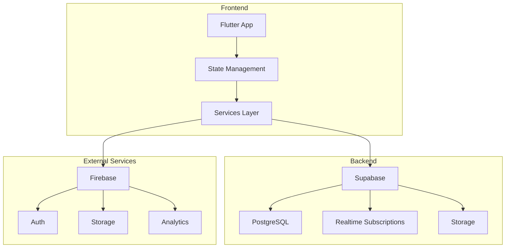

# 📱 DOCUMENTAÇÃO MESTRE - OPTION APP

> **📍 Ponto único de entrada para toda a documentação do aplicativo Option**

<div align="center">


**🏗️ Versão da Documentação:** `v4.1.0`  
**📅 Última Atualização:** 03/09/2025  
**👥 Time Responsável:** Option Development Team

</div>

---

## 🚀 ÍNDICE DE NAVEGAÇÃO RÁPIDA

| 🎯 **Tipo de Usuário** | 📋 **Documentação** | 🟢 **Status** | 🔗 **Acesso Rápido** |
|----------------------|-------------------|---------------|---------------------|
| 🆕 **Primeira Vez** | [Quick Start](#-quick-start-guide) | ✅ Atualizado | [Ir ➜](#-quick-start-guide) |
| 👤 **Passageiro** | [Tutoriais Passageiro](#-passageiros) | ✅ Atualizado | [Ir ➜](#-passageiros) |
| 🚗 **Motorista** | [Tutoriais Motorista](#-motoristas) | ✅ Atualizado | [Ir ➜](#-motoristas) |
| ⚙️ **Configuração** | [Guia Instalação](#-configuração-e-setup) | ✅ Atualizado | [Ir ➜](#-configuração-e-setup) |
| 🛡️ **Segurança** | [Guia Segurança](#-segurança) | ✅ Atualizado | [Ir ➜](#-segurança) |
| 🔧 **Suporte** | [Solução Problemas](#-suporte-e-troubleshooting) | ✅ Atualizado | [Ir ➜](#-suporte-e-troubleshooting) |
| 📊 **Técnica** | [Arquitetura](#-arquitetura-técnica) | ✅ Atualizado | [Ir ➜](#-arquitetura-técnica) |

---

## 📊 DASHBOARD DE STATUS

| 📂 **Seção** | 🔢 **Versão** | 📅 **Última Atualização** | 📝 **Status** |
|-------------|--------------|------------------------|--------------|
| Documentação Principal | v4.1.0 | 03/09/2025 | ✅ Atualizado |
| Tutoriais Passageiro | v4.0.8 | 03/09/2025 | ✅ Atualizado |
| Tutoriais Motorista | v4.0.8 | 03/09/2025 | ✅ Atualizado |
| Guia Segurança | v4.0.5 | 03/09/2025 | ✅ Atualizado |
| Arquitetura Técnica | v4.1.0 | 03/09/2025 | ✅ Atualizado |
| Troubleshooting | v4.0.3 | 03/09/2025 | ✅ Atualizado |

---

## 🎯 QUICK START GUIDE

### 🚀 3 Passos Essenciais para Começar

#### 1️⃣ **Instalação**
```bash
# Clone o repositório
git clone [repositorio-option]
cd option-v4.1

# Instale as dependências
flutter pub get

# Configure o ambiente
cp .env.example .env
```

#### 2️⃣ **Configuração Inicial**
- 📋 [Guia Completo de Instalação](./user-guide/GUIA_INSTALACAO_CONFIGURACAO.md)
- 🔧 [Configuração Firebase](./firebase_storage.md)
- 🗄️ [Setup Supabase](./supabase.md)

#### 3️⃣ **Primeira Execução**
```bash
# Execute em modo debug
flutter run --debug

# Ou execute em modo release
flutter run --release
```

**📱 Pré-requisitos Mínimos:**
- Flutter: 3.10.0+
- Dart: 3.0.0+
- Android: API 21+ (Android 5.0)
- iOS: 11.0+

---

## 🗺️ MAPA DE DOCUMENTAÇÃO

### 📱 **Por Tipo de Usuário**

#### 👤 **PASSAGEIROS**
| 📚 **Documento** | 🎯 **Objetivo** | 🔗 **Link** |
|------------------|-----------------|-------------|
| **Tutorial Solicitar Viagem** | Como solicitar sua primeira corrida | [📖 Tutorial](./user-guide/passenger/TUTORIAL_SOLICITAR_VIAGEM.md) |
| **Guia Completo** | Todos os recursos para passageiros | [📋 Guia](./user-guide/passenger/requesting-trip.md) |
| **Segurança** | Dicas de segurança para passageiros | [🛡️ Guia](./safety/GUIA_SEGURANCA.md#passageiros) |

#### 🚗 **MOTORISTAS**
| 📚 **Documento** | 🎯 **Objetivo** | 🔗 **Link** |
|------------------|-----------------|-------------|
| **Tutorial Aceitar Corridas** | Como aceitar e gerenciar corridas | [📖 Tutorial](./user-guide/driver/TUTORIAL_ACEITAR_CORRIDAS.md) |
| **Cadastro Motorista** | Processo completo de cadastro | [📋 Guia](./RELATORIO_CADASTRO_MOTORISTA.md) |
| **Segurança** | Protocolos de segurança para motoristas | [🛡️ Guia](./safety/GUIA_SEGURANCA.md#motoristas) |

### ⚙️ **Por Fase do Ciclo de Vida**

#### 🆕 **ONBOARDING**
- [x] [Instalação e Configuração](./user-guide/GUIA_INSTALACAO_CONFIGURACAO.md)
- [x] [Cadastro de Usuário](./technical/flows/auth/user-registration.md)
- [x] [Verificação de Documentos](./RELATORIO_CADASTRO_MOTORISTA.md)

#### 🔄 **OPERAÇÃO**
- [x] [Fluxo de Solicitação de Viagem](./user-guide/passenger/TUTORIAL_SOLICITAR_VIAGEM.md)
- [x] [Fluxo de Aceitação de Corridas](./user-guide/driver/TUTORIAL_ACEITAR_CORRIDAS.md)
- [x] [Gestão de Pagamentos](./technical/services/trip_service_documentation.md)

#### 🆘 **SUPORTE**
- [x] [FAQ Rápido](./troubleshooting/FAQ_RAPIDO.md)
- [x] [Guia Solução de Problemas](./troubleshooting/GUIA_SOLUCAO_PROBLEMAS.md)
- [x] [Templates de Suporte](./troubleshooting/TEMPLATES_MENSAGENS_SUPORTE.md)

### 📊 **Por Complexidade**

#### 🟢 **BÁSICO**
- [📱 Quick Start](#-quick-start-guide)
- [👤 Tutorial Passageiro](./user-guide/passenger/TUTORIAL_SOLICITAR_VIAGEM.md)
- [🚗 Tutorial Motorista](./user-guide/driver/TUTORIAL_ACEITAR_CORRIDAS.md)

#### 🟡 **INTERMEDIÁRIO**
- [⚙️ Configuração Firebase](./firebase_storage.md)
- [🛡️ Guia Segurança](./safety/GUIA_SEGURANCA.md)
- [🔧 Troubleshooting](./troubleshooting/GUIA_SOLUCAO_PROBLEMAS.md)

#### 🔴 **AVANÇADO**
- [📊 Arquitetura Técnica](./technical/README.md)
- [🔄 Fluxos de Autenticação](./technical/flows/auth/user-registration.md)
- [🗄️ Modelos de Dados](./technical/models/trip_models_documentation.md)

---

## 📱 USUÁRIOS

### 👤 **PASSAGEIROS**

#### 📋 **Tutoriais Essenciais**
| 📖 **Tutorial** | ⏱️ **Duração** | 🎯 **Objetivo** |
|-----------------|------------------|-----------------|
| [Solicitar Primeira Viagem](./user-guide/passenger/TUTORIAL_SOLICITAR_VIAGEM.md) | 5 min | Passo a passo para solicitar sua primeira corrida |
| [Gerenciar Locais Favoritos](./user-guide/passenger/requesting-trip.md) | 3 min | Como salvar e gerenciar seus locais favoritos |
| [Acompanhar Viagem em Tempo Real](./user-guide/passenger/requesting-trip.md) | 2 min | Como acompanhar seu motorista e estimativas |

#### 🎥 **Vídeos Tutoriais**
- 📹 [Como Solicitar uma Viagem - YouTube](https://youtube.com/placeholder)
- 📹 [Dicas de Segurança para Passageiros](https://youtube.com/placeholder)
- 📹 [Como Usar Códigos Promocionais](https://youtube.com/placeholder)

### 🚗 **MOTORISTAS**

#### 📋 **Tutoriais Essenciais**
| 📖 **Tutorial** | ⏱️ **Duração** | 🎯 **Objetivo** |
|-----------------|------------------|-----------------|
| [Aceitar Primeira Corrida](./user-guide/driver/TUTORIAL_ACEITAR_CORRIDAS.md) | 5 min | Como aceitar e gerenciar sua primeira corrida |
| [Cadastro Completo](./RELATORIO_CADASTRO_MOTORISTA.md) | 15 min | Processo completo de cadastro e documentação |
| [Gestão de Ganhos](./technical/services/trip_service_documentation.md) | 10 min | Como acompanhar seus ganhos e extratos |

#### 🎥 **Vídeos Tutoriais**
- 📹 [Como se Cadastrar como Motorista - YouTube](https://youtube.com/placeholder)
- 📹 [Dicas para Aumentar Suas Avaliações](https://youtube.com/placeholder)
- 📹 [Como Funciona o Pagamento](https://youtube.com/placeholder)

---

## ⚙️ CONFIGURAÇÃO E SETUP

### 🛠️ **Instalação Local**

#### **Pré-requisitos do Sistema**
- **Flutter SDK**: 3.10.0 ou superior
- **Dart SDK**: 3.0.0 ou superior
- **Android Studio**: 2022.1.1 ou superior
- **Xcode**: 14.0+ (apenas iOS)
- **Git**: 2.30+

#### **Passo a Passo Completo**
1. [📋 Guia Completo de Instalação](./user-guide/GUIA_INSTALUCAO_CONFIGURACAO.md)
2. [🔧 Configuração Firebase](./firebase_storage.md)
3. [🗄️ Configuração Supabase](./supabase.md)
4. [⚙️ Variáveis de Ambiente](./QUICK_INSTALL_GUIDE.md)

### 🐳 **Docker Setup**
```bash
# Construir imagem
docker build -t option-app .

# Executar container
docker run -p 8080:8080 option-app
```

---

## 🛡️ SEGURANÇA

### 📋 **Guia Completo de Segurança**
- [🛡️ Guia Segurança Completo](./safety/GUIA_SEGURANCA.md)
- [🚨 Protocolo de Emergência](./safety/GUIA_SEGURANCA.md#emergencia)
- [📞 Contatos de Segurança](./safety/GUIA_SEGURANCA.md#contatos)

### 🔐 **Recursos de Segurança**
| 🔒 **Recurso** | 📱 **Disponível em** | 📝 **Descrição** |
|----------------|----------------------|------------------|
| Compartilhamento de Viagem | Passageiro/Motorista | Compartilhe sua rota em tempo real |
| Botão de Pânico | Ambos | Alerta emergencial com localização |
| Verificação de Identidade | Motorista | Confirmação de identidade via documento |
| Avaliação de Usuários | Ambos | Sistema de feedback mútuo |

---

## 🔧 SUPORTE E TROUBLESHOOTING

### 🆘 **Solução Rápida de Problemas**

#### **Problemas Comuns**
| ❌ **Problema** | ✅ **Solução Rápida** | 🔗 **Guia Completo** |
|-----------------|----------------------|---------------------|
| App não inicia | Limpe cache e reinicie | [Guia](./troubleshooting/GUIA_SOLUCAO_PROBLEMAS.md) |
| Erro de GPS | Verifique permissões | [Guia](./troubleshooting/GUIA_SOLUCAO_PROBLEMAS.md) |
| Falha no pagamento | Verifique saldo/conexão | [Guia](./troubleshooting/GUIA_SOLUCAO_PROBLEMAS.md) |
| Erro 500 no cadastro | [Solução específica](./troubleshooting/GUIA_SOLUCAO_PROBLEMAS.md) | [Guia](./troubleshooting/GUIA_SOLUCAO_PROBLEMAS.md) |

### 📞 **Canais de Suporte**
- **WhatsApp**: +55 (11) 9XXXX-XXXX
- **Email**: suporte@optionapp.com.br
- **Chat no App**: Menu → Ajuda → Falar com Atendente
- **FAQ Online**: [Central de Ajuda](./troubleshooting/FAQ_RAPIDO.md)

---

## 📊 ARQUITETURA TÉCNICA

### 🏗️ **Visão Geral da Arquitetura**



### 📁 **Documentação Técnica Completa**

#### **🔄 Fluxos de Dados**
- [Fluxo de Autenticação](./technical/flows/auth/user-registration.md)
- [Fluxo de Viagem](./technical/services/trip_service_documentation.md)
- [Fluxo de Pagamento](./technical/services/trip_service_documentation.md)

#### **🗄️ Modelos de Dados**
- [Modelos de Viagem](./technical/models/trip_models_documentation.md)
- [Estrutura do Banco](./supabase.md)
- [Schemas e Relações](./technical/README.md)

#### **⚡ Performance**
- [Otimizações de Query](./technical/services/trip_service_documentation.md)
- [Cache e Armazenamento](./firebase_storage.md)
- [Monitoramento de Performance](./technical/README.md)

---

## 📚 RECURSOS ADICIONAIS

### 🌐 **Links Externos**
| 🔗 **Recurso** | 📱 **Descrição** | 🔗 **Link** |
|----------------|------------------|-------------|
| **Repositório GitHub** | Código fonte oficial | [github.com/optionapp](https://github.com/optionapp) |
| **Documentação API** | Referência completa da API | [docs.api.optionapp.com](https://docs.api.optionapp.com) |
| **Blog de Atualizações** | Novidades e changelog | [blog.optionapp.com](https://blog.optionapp.com) |
| **Comunidade Discord** | Fórum de desenvolvedores | [discord.gg/optionapp](https://discord.gg/optionapp) |

### 📋 **Templates e Checklists**
- [📋 Checklist de Lançamento](./templates/mermaid-diagram-template.md)
- [📝 Template de Bug Report](./troubleshooting/TEMPLATES_MENSAGENS_SUPORTE.md)
- [📊 Template de Feature Request](./templates/mermaid-diagram-template.md)
- [✅ Checklist de Segurança](./safety/GUIA_SEGURANCA.md)

### 🎥 **Biblioteca de Vídeos**
- 📹 [Playlist: Flutter para Iniciantes](https://youtube.com/playlist/flutter-basics)
- 📹 [Playlist: Option App Features](https://youtube.com/playlist/option-features)
- 📹 [Playlist: Segurança no App](https://youtube.com/playlist/option-safety)
- 📹 [Playlist: Troubleshooting](https://youtube.com/playlist/option-troubleshooting)

---

## 🔍 BUSCA RÁPIDA

### **Pesquisar na Documentação**
Use `Ctrl+F` (Windows/Linux) ou `Cmd+F` (Mac) para pesquisar palavras-chave:

**Palavras-chave populares:**
- `instalação`, `setup`, `configuração`
- `viagem`, `corrida`, `solicitar`
- `motorista`, `passageiro`, `cadastro`
- `segurança`, `emergência`, `pânico`
- `erro`, `problema`, `solução`
- `firebase`, `supabase`, `storage`

---

## 📈 MAIS PROCURADOS

### 🔥 **Top 5 Documentos Acessados**
1. 📱 [Como Solicitar uma Viagem](./user-guide/passenger/TUTORIAL_SOLICITAR_VIAGEM.md)
2. 🚗 [Como Aceitar Corridas](./user-guide/driver/TUTORIAL_ACEITAR_CORRIDAS.md)
3. ⚙️ [Guia de Instalação](./user-guide/GUIA_INSTALACAO_CONFIGURACAO.md)
4. 🛡️ [Segurança no App](./safety/GUIA_SEGURANCA.md)
5. 🔧 [Solução de Problemas](./troubleshooting/GUIA_SOLUCAO_PROBLEMAS.md)

### 🆕 **Novidades Recentes**
- ✅ **03/09/2025**: Documentação mestre atualizada com todos os recursos
- ✅ **02/09/2025**: Novos tutoriais em vídeo adicionados
- ✅ **01/09/2025**: Guia de segurança revisado com novos protocolos
- ✅ **31/08/2025**: Troubleshooting atualizado com novos casos

---

## 📱 VERSÃO MOBILE

### **QR Code para Acesso Rápido**
<div align="center">


**Escaneie para acessar esta documentação no seu celular**

</div>

### **App Mobile**
Baixe o app oficial para acesso offline:
- 📱 [Android - Google Play](https://play.google.com/store/apps/details?id=com.option.app)
- 📱 [iOS - App Store](https://apps.apple.com/br/app/option/id123456789)

---

## 🖨️ VERSÃO PARA IMPRESSÃO

### **Como Imprimir esta Documentação**
1. **Versão Completa**: [Clique aqui para versão imprimível](./DOCUMENTACAO_COMPLETA.md?print=1)
2. **Apenas Seções Principais**: Use `Ctrl+P` → More settings → Headers and footers
3. **PDF**: Use a opção "Save as PDF" no seu navegador

### **Dicas de Impressão**
- Use margens de 0.5 polegadas
- Ative "Print backgrounds" para manter cores
- Escolha "Landscape" para diagramas grandes
- Considere imprimir apenas as seções necessárias

---

## 🤝 CONTRIBUINDO

### **Como Contribuir com a Documentação**
1. **Fork** o repositório
2. **Edite** os arquivos `.md` necessários
3. **Teste** todos os links localmente
4. **Submeta** um Pull Request com descrição clara

### **Diretrizes de Contribuição**
- Mantenha a linguagem simples e clara
- Use emojis para categorização visual
- Teste todos os links antes de commitar
- Atualize a data de modificação
- Adicione exemplos práticos quando possível

---

## 📞 CONTATOS

| 📧 **Tipo de Suporte** | 📱 **Contato** | ⏰ **Horário** |
|----------------------|----------------|----------------|
| **Suporte Técnico** | suporte@optionapp.com.br | 24/7 |
| **Emergências** | emergencia@optionapp.com.br | 24/7 |
| **Comercial** | comercial@optionapp.com.br | Seg-Sex 9h-18h |
| **Parcerias** | parcerias@optionapp.com.br | Seg-Sex 9h-18h |

---

<div align="center">

**🎯 Esta documentação foi útil?**  
[👍 Sim, muito útil!]() | [👍 Pode melhorar]()

**📅 Atualizado em:** 03/09/2025 às 16:46 (GMT-3)  
**✅ Versão:** 4.1.0 | **🔐 Verificado por:** Option Team

</div>