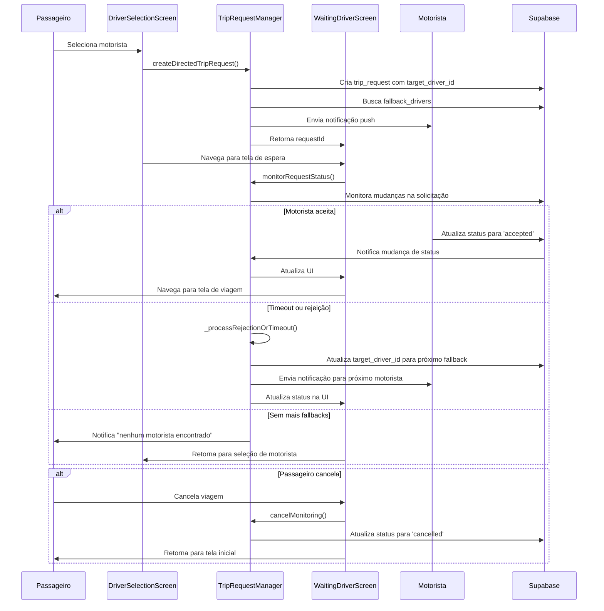

# Integração do Sistema de Matching Direcionado

## 1. Análise Técnica dos Arquivos de Documentação

### 1.1 Análise do arquivo `supabase.md`

O arquivo `supabase.md` define a estrutura completa do banco de dados da aplicação. Para o sistema de matching direcionado, as principais tabelas relevantes são:

#### Tabela `trip_requests`
- **Campos críticos para matching direcionado:**
  - `target_driver_id`: ID do motorista alvo para solicitação direcionada
  - `fallback_drivers`: Array JSON com lista de motoristas de fallback
  - `accepted_by_driver_id`: ID do motorista que aceitou a solicitação
  - `current_fallback_index`: Índice atual na lista de fallback
  - `timeout_count`: Contador de timeouts para controle de tentativas
  - `expires_at`: Timestamp de expiração da solicitação

#### Tabela `drivers`
- **Campos relevantes:**
  - `is_online`: Status de disponibilidade do motorista
  - `current_latitude`, `current_longitude`: Localização atual
  - `vehicle_category`: Categoria do veículo
  - `accepts_pet`, `accepts_grocery`, `accepts_condo`: Preferências de serviço
  - `custom_price_per_km`, `custom_price_per_minute`: Preços personalizados

#### View `available_drivers_view`
- Fornece uma visão otimizada dos motoristas disponíveis com filtros aplicados
- Inclui cálculos de distância e disponibilidade em tempo real

### 1.2 Análise do arquivo `Fluxo do negocio.md`

O documento define o fluxo completo de negócio da plataforma de mobilidade urbana:

#### Fluxo do Passageiro
1. **Solicitação de Viagem:**
   - Definição de origem e destino
   - Seleção de categoria de veículo
   - Configuração de preferências (pet, grocery, condo)
   - Escolha do motorista específico

2. **Processo de Matching:**
   - Query inicial de motoristas disponíveis
   - Filtragem por zona de exclusão e preferências
   - Cálculo de preço individual por motorista
   - Ordenação por critérios de relevância

#### Fluxo do Condutor
1. **Configuração de Perfil:**
   - Ajustes de ganhos e preços personalizados
   - Definição de áreas de atendimento
   - Configuração de serviços adicionais

2. **Recebimento de Solicitações:**
   - Notificações push direcionadas
   - Interface para aceitar/rejeitar viagens
   - Sistema de fallback automático

#### Lógica de Precificação
```
Preço Final = (Distância × Preço/KM) + (Tempo × Preço/Minuto) + Taxa Base
```

## 2. Diagrama de Sequência das Interações



## 3. Especificações Técnicas para Implementação

### 3.1 Arquitetura do Sistema

#### TripRequestManager
- **Responsabilidades:**
  - Criação de solicitações direcionadas
  - Gerenciamento de timeouts e fallbacks
  - Monitoramento de status em tempo real
  - Envio de notificações push

- **Métodos principais:**
  ```dart
  Future<String> createDirectedTripRequest(TripRequestData data)
  void monitorRequestStatus(String requestId)
  void cancelMonitoring(String requestId)
  Future<void> _processRejectionOrTimeout(String requestId)
  ```

#### DriverSelectionScreen
- **Integração com TripRequestManager:**
  - Busca motoristas disponíveis via `DriverService.getAvailableDriversNearby()`
  - Cria lista priorizada de motoristas para fallback
  - Utiliza `TripRequestManager.createDirectedTripRequest()` na seleção

#### WaitingDriverScreen
- **Funcionalidades integradas:**
  - Monitoramento em tempo real via `TripRequestManager.monitorRequestStatus()`
  - Cancelamento de solicitações via `TripRequestManager.cancelMonitoring()`
  - Feedback visual do progresso de matching

### 3.2 Estrutura de Dados

#### TripRequestData
```dart
class TripRequestData {
  final String passengerId;
  final double originLatitude;
  final double originLongitude;
  final String originAddress;
  final double destinationLatitude;
  final double destinationLongitude;
  final String destinationAddress;
  final String vehicleCategory;
  final bool needsPet;
  final bool needsGrocerySpace;
  final bool needsAc;
  final double estimatedFare;
  final List<String> prioritizedDriverIds;
}
```

#### Campos adicionais na tabela trip_requests
```sql
ALTER TABLE trip_requests ADD COLUMN target_driver_id UUID REFERENCES drivers(id);
ALTER TABLE trip_requests ADD COLUMN fallback_drivers JSONB;
ALTER TABLE trip_requests ADD COLUMN accepted_by_driver_id UUID REFERENCES drivers(id);
ALTER TABLE trip_requests ADD COLUMN current_fallback_index INTEGER DEFAULT 0;
ALTER TABLE trip_requests ADD COLUMN timeout_count INTEGER DEFAULT 0;
ALTER TABLE trip_requests ADD COLUMN expires_at TIMESTAMPTZ;
```

### 3.3 Fluxo de Estados

#### Estados da Solicitação
1. **pending**: Solicitação criada, aguardando resposta do motorista alvo
2. **accepted**: Motorista aceitou a solicitação
3. **rejected**: Motorista rejeitou, processando fallback
4. **timeout**: Timeout atingido, processando fallback
5. **no_drivers_available**: Todos os fallbacks esgotados
6. **cancelled**: Solicitação cancelada pelo passageiro

#### Timeouts e Tentativas
- **Timeout por motorista**: 30 segundos
- **Máximo de tentativas**: 3 por motorista
- **Máximo de fallbacks**: 10 motoristas
- **Timeout total**: 15 minutos

### 3.4 Sistema de Notificações

#### Notificações Push para Motoristas
```dart
class DriverNotification {
  final String tripRequestId;
  final String passengerId;
  final String originAddress;
  final String destinationAddress;
  final double estimatedFare;
  final double distanceKm;
  final int etaMinutes;
}
```

#### Notificações para Passageiros
- Status de progresso do matching
- Confirmação de aceitação pelo motorista
- Notificação de "nenhum motorista encontrado"

## 4. Plano de Validação

### 4.1 Testes Unitários

#### TripRequestManager
- [ ] Teste de criação de solicitação direcionada
- [ ] Teste de processamento de timeout
- [ ] Teste de processamento de rejeição
- [ ] Teste de fallback automático
- [ ] Teste de cancelamento de monitoramento
- [ ] Teste de esgotamento de fallbacks

#### DriverService
- [ ] Teste de busca de motoristas disponíveis
- [ ] Teste de filtros de categoria e preferências
- [ ] Teste de cálculo de distância
- [ ] Teste de ordenação por proximidade

### 4.2 Testes de Integração

#### Fluxo Completo de Matching
- [ ] Teste de solicitação direcionada bem-sucedida
- [ ] Teste de fallback automático
- [ ] Teste de cancelamento pelo passageiro
- [ ] Teste de timeout e recuperação
- [ ] Teste de múltiplos passageiros simultâneos

#### Integração com UI
- [ ] Teste de navegação entre telas
- [ ] Teste de atualização de status em tempo real
- [ ] Teste de feedback visual para o usuário
- [ ] Teste de tratamento de erros

### 4.3 Testes de Performance

#### Carga e Escalabilidade
- [ ] Teste com 100 solicitações simultâneas
- [ ] Teste de latência de notificações push
- [ ] Teste de performance de queries de motoristas
- [ ] Teste de memory leaks em monitoramento prolongado

#### Tempo de Resposta
- [ ] Criação de solicitação: < 500ms
- [ ] Notificação push: < 2s
- [ ] Atualização de status: < 1s
- [ ] Fallback automático: < 5s

### 4.4 Testes de Usabilidade

#### Experiência do Passageiro
- [ ] Clareza do feedback de progresso
- [ ] Facilidade de cancelamento
- [ ] Compreensão dos estados de busca
- [ ] Satisfação com tempo de resposta

#### Experiência do Motorista
- [ ] Clareza das notificações recebidas
- [ ] Facilidade de aceitar/rejeitar
- [ ] Informações suficientes para decisão
- [ ] Tempo adequado para resposta

### 4.5 Critérios de Aceitação

#### Funcionalidade
- ✅ Sistema cria solicitações direcionadas corretamente
- ✅ Fallback automático funciona conforme especificado
- ✅ Notificações push são enviadas e recebidas
- ✅ Cancelamento funciona em todos os estados
- ✅ UI reflete status em tempo real

#### Performance
- [ ] 95% das solicitações processadas em < 30s
- [ ] 99% das notificações entregues em < 5s
- [ ] Sistema suporta 500+ usuários simultâneos
- [ ] Sem memory leaks após 24h de operação

#### Qualidade
- [ ] Cobertura de testes > 90%
- [ ] Zero crashes em produção
- [ ] Logs detalhados para debugging
- [ ] Monitoramento de métricas em tempo real

## 5. Próximos Passos

### 5.1 Implementação Imediata
1. **Executar testes de integração** entre `TripRequestManager` e as telas
2. **Implementar sistema de notificações push** completo
3. **Criar testes unitários** para todas as funcionalidades
4. **Configurar monitoramento** de métricas em produção

### 5.2 Melhorias Futuras
1. **Machine Learning** para otimização de fallbacks
2. **Previsão de demanda** para pré-posicionamento de motoristas
3. **Algoritmos de roteamento** mais sofisticados
4. **Integração com mapas** para visualização em tempo real

### 5.3 Monitoramento e Métricas

#### KPIs Principais
- Taxa de aceitação de solicitações direcionadas
- Tempo médio de matching
- Taxa de cancelamento por timeout
- Satisfação do usuário (NPS)

#### Alertas Críticos
- Taxa de erro > 5%
- Tempo de matching > 5 minutos
- Falha no envio de notificações
- Indisponibilidade do sistema > 30s

---

**Documento criado em:** Janeiro 2025  
**Versão:** 1.0  
**Responsável:** Sistema de Matching Direcionado  
**Próxima revisão:** Após implementação dos testes de integração