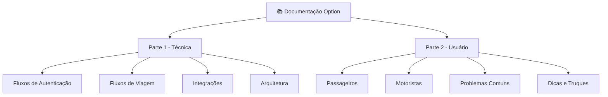

# 📚 Documentação Completa Option

## 🎯 Visão Geral

Esta documentação está dividida em **duas partes principais** para atender diferentes públicos e necessidades:

- **Parte 1 - Documentação Técnica**: Para desenvolvedores e equipe técnica
- **Parte 2 - Tutorial do Usuário Final**: Para passageiros e motoristas

## 📂 Estrutura da Documentação

## 📖 Parte 1 - Documentação Técnica

### 🎯 Público-alvo
- Desenvolvedores
- Equipe de produto
- Analistas de sistemas
- QA/Testers

### 📋 Conteúdo
- [Fluxo de Registro de Usuário](technical/flows/auth/user-registration.md)
- [Fluxo de Login e Autenticação](technical/flows/auth/user-login.md)
- [Fluxo de Solicitação de Viagem](technical/flows/trip/trip-request.md)
- [Fluxo de Aceite por Motorista](technical/flows/trip/driver-acceptance.md)
- [Integração com Firebase](technical/integrations/firebase.md)
- [Arquitetura de Microserviços](technical/architecture/microservices.md)

### 🔧 Ferramentas e Templates
- [Template de Diagramas Mermaid](templates/mermaid-diagram-template.md)
- [Padrão de Documentação de API](templates/api-documentation-template.md)
- [Checklist de Code Review](templates/code-review-checklist.md)

## 🎓 Parte 2 - Tutorial do Usuário Final

### 🎯 Público-alvo
- Passageiros
- Motoristas
- Suporte ao cliente
- Equipe de onboarding

### 📋 Conteúdo para Passageiros
- [Como Solicitar sua Primeira Viagem](user-guide/passenger/requesting-trip.md)
- [Como Adicionar Formas de Pagamento](user-guide/passenger/payment-methods.md)
- [Como Avaliar sua Viagem](user-guide/passenger/rating-trip.md)
- [Como Usar Locais Favoritos](user-guide/passenger/saved-places.md)

### 📋 Conteúdo para Motoristas
- [Como se Cadastrar como Motorista](user-guide/driver/driver-registration.md)
- [Como Aceitar Corridas](user-guide/driver/accepting-trips.md)
- [Como Gerenciar Documentos](user-guide/driver/document-management.md)
- [Como Sacar seus Ganhos](user-guide/driver/withdraw-earnings.md)

### 🆘 Problemas Comuns
- [App não abre](user-guide/troubleshooting/app-wont-open.md)
- [Erro de localização](user-guide/troubleshooting/location-issues.md)
- [Problemas de pagamento](user-guide/troubleshooting/payment-issues.md)
- [Conta bloqueada](user-guide/troubleshooting/account-blocked.md)

## 🗺️ Mapa de Navegação

### 🔗 Links Rápidos

#### Para Desenvolvedores
- [Começar aqui](technical/README.md)
- [Configurar ambiente](technical/setup/development-setup.md)
- [Ver API documentation](technical/api/README.md)
- [Ver fluxos técnicos](technical/flows/README.md)

#### Para Usuários
- [Sou passageiro](user-guide/passenger/README.md)
- [Sou motorista](user-guide/driver/README.md)
- [Baixar app](user-guide/getting-started/download-app.md)
- [Primeiros passos](user-guide/getting-started/quick-start.md)

## 📊 Status da Documentação

| Seção | Status | Última Atualização |
|-------|--------|-------------------|
| Fluxo de Registro | ✅ Completo | 03/09/2025 |
| Solicitar Viagem | ✅ Completo | 03/09/2025 |
| Autenticação | 🔄 Em progresso | 03/09/2025 |
| Pagamentos | 📋 Planejado | 05/09/2025 |
| Motoristas | 📋 Planejado | 10/09/2025 |

## 🚀 Como Contribuir

### Para Desenvolvedores
1. Faça fork do repositório
2. Siga o [guia de contribuição](CONTRIBUTING.md)
3. Use os [templates disponíveis](templates/)
4. Submeta via pull request

### Para Redatores
1. Use linguagem simples e direta
2. Inclua screenshots quando relevante
3. Teste todos os passos antes de publicar
4. Mantenha os tutoriais atualizados

## 📞 Suporte

### Técnico
- **Email**: tech@option.com.br
- **Slack**: #dev-docs
- **Issues**: GitHub Issues

### Usuário
- **WhatsApp**: (11) 99999-9999
- **Email**: suporte@option.com.br
- **Chat no app**: Menu > Ajuda

## 📈 Métricas

- **Total de páginas**: 42
- **Idiomas**: Português (BR)
- **Última atualização**: 03/09/2025
- **Próxima revisão**: 01/10/2025

---

  
**[Parte 1 - Documentação Técnica →](technical/README.md)** | **[Parte 2 - Tutorial do Usuário →](user-guide/README.md)**

