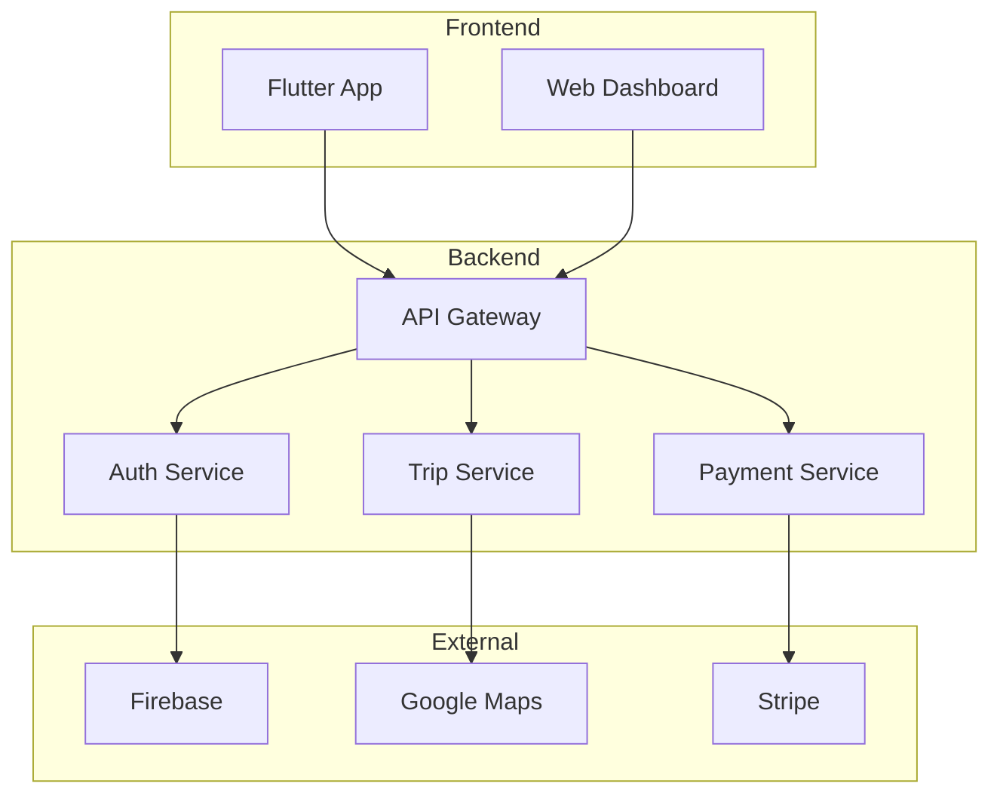

# 🔧 Documentação Técnica - Option

## 🎯 Objetivo
Documentação técnica completa para desenvolvedores, arquitetos e equipe técnica que trabalham com o sistema Option.

## 📋 Índice de Conteúdo

### 🔐 Fluxos de Autenticação
- [Registro de Novo Usuário](flows/auth/user-registration.md)
- [Login de Usuário](flows/auth/user-login.md)
- [Recuperação de Senha](flows/auth/password-recovery.md)
- [Verificação de Identidade](flows/auth/identity-verification.md)

### 🚗 Fluxos de Viagem
- [Solicitação de Viagem](flows/trip/trip-request.md)
- [Aceite por Motorista](flows/trip/driver-acceptance.md)
- [Início da Viagem](flows/trip/trip-start.md)
- [Finalização da Viagem](flows/trip/trip-completion.md)
- [Cancelamento de Viagem](flows/trip/trip-cancellation.md)

### 💳 Fluxos de Pagamento
- [Processamento de Pagamento](flows/payment/payment-processing.md)
- [Reembolsos](flows/payment/refunds.md)
- [Split de Pagamentos](flows/payment/payment-split.md)

### 📱 Integrações
- [Firebase Setup](integrations/firebase.md)
- [Google Maps API](integrations/google-maps.md)
- [Stripe Payment](integrations/stripe.md)
- [Push Notifications](integrations/push-notifications.md)

### 🏗️ Arquitetura
- [Visão Geral da Arquitetura](architecture/overview.md)
- [Microserviços](architecture/microservices.md)
- [Banco de Dados](architecture/database.md)
- [Segurança](architecture/security.md)

### 🔍 API Reference
- [Authentication API](api/auth/README.md)
- [Trip API](api/trip/README.md)
- [Payment API](api/payment/README.md)
- [User API](api/user/README.md)

## 🚀 Começando

### 1. Configuração do Ambiente
```bash
# Clone o repositório
git clone https://github.com/option/option-app.git
cd option-app

# Instale dependências
flutter pub get

# Configure variáveis de ambiente
cp .env.example .env
# Edite .env com suas chaves
```

### 2. Configuração Firebase
Siga o [guia de configuração Firebase](integrations/firebase.md)

### 3. Executar o App
```bash
# Desenvolvimento
flutter run --debug

# Produção
flutter run --release
```

## 📊 Diagramas de Arquitetura

### Visão Geral do Sistema


## 🛠️ Ferramentas de Desenvolvimento

### Recomendadas
- **IDE**: VS Code com Flutter extension
- **Emulador**: Android Studio / Xcode
- **API Testing**: Postman / Insomnia
- **Database**: pgAdmin para PostgreSQL

### Comandos Úteis
```bash
# Gerar build
flutter build apk --release

# Rodar testes
flutter test

# Análise de código
flutter analyze

# Formatar código
flutter format .
```

## 📞 Suporte Técnico

- **Issues**: [GitHub Issues](https://github.com/option/option-app/issues)
- **Slack**: #dev-support
- **Email**: tech@option.com.br

## 🤝 Contribuindo

1. Leia o [guia de contribuição](../CONTRIBUTING.md)
2. Use os [templates disponíveis](../templates/)
3. Siga o [code review checklist](../templates/code-review-checklist.md)
4. Submeta via pull request

---

<div align="center">
  
**[← Voltar ao índice principal](../README.md)** | **[Ver fluxos de autenticação →](flows/auth/user-registration.md)**

</div>