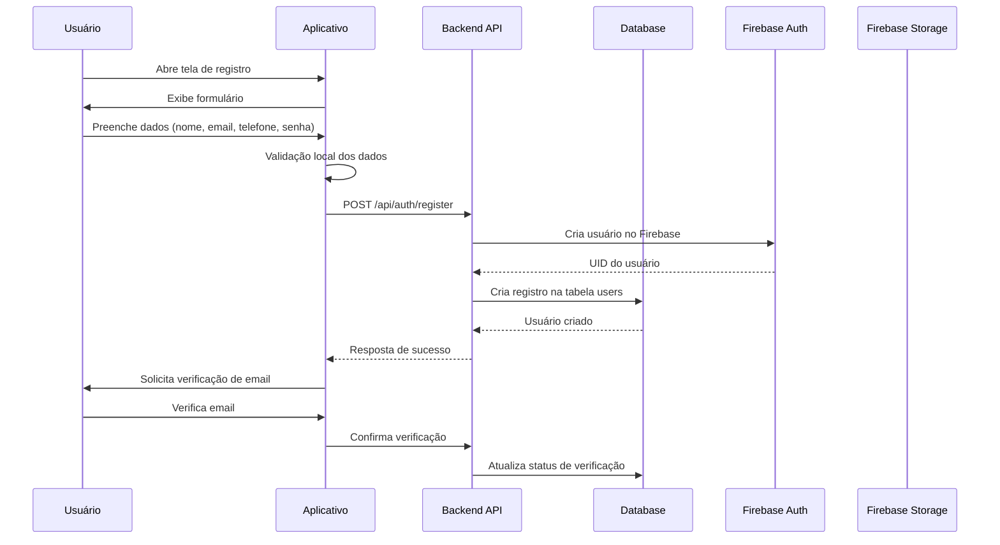
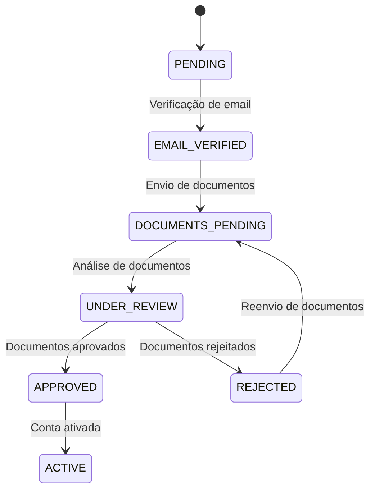

# 🔐 Fluxo de Registro de Novo Usuário

## 📋 Visão Geral
Processo completo de cadastro de novos usuários no sistema Option, incluindo validação de dados, verificação de identidade e criação de perfil.

## 🎯 Objetivo
Permitir que novos usuários se cadastrem de forma segura e eficiente no sistema, com validação de dados e verificação de identidade quando necessário.

## 🔄 Fluxo Principal

### Diagrama de Sequência

## 📝 Campos de Registro

| Campo | Tipo | Obrigatório | Validação |
|-------|------|-------------|-----------|
| `full_name` | string | ✅ | Mínimo 3 caracteres |
| `email` | string | ✅ | Formato email válido |
| `phone` | string | ✅ | Formato brasileiro |
| `password` | string | ✅ | Mínimo 8 caracteres |
| `user_type` | enum | ✅ | 'passenger' ou 'driver' |
| `cpf` | string | ✅* | Apenas para motoristas |
| `date_of_birth` | date | ✅* | Apenas para motoristas |

*Campos adicionais para motoristas

## 🔍 Validações

### Frontend (lib/screens/auth/register_screen.dart)
- Validação de formato de email
- Validação de força de senha
- Máscara para telefone brasileiro
- Validação de CPF

### Backend (API endpoints)
- Verificação de email duplicado
- Verificação de CPF duplicado
- Validação de idade mínima (18 anos para motoristas)
- Sanitização de inputs

## 🛡️ Segurança

### Criptografia
- Senhas são hasheadas com bcrypt (12 rounds)
- Dados sensíveis são criptografados no banco
- Tokens JWT com expiração de 24h

### Rate Limiting
- Máximo 5 tentativas por minuto por IP
- Bloqueio temporário após tentativas falhas
- Captcha após 3 tentativas

## 📊 Estados do Usuário

## 🔗 Endpoints Relacionados

| Método | Endpoint | Descrição |
|--------|----------|-----------|
| POST | `/api/auth/register` | Criar novo usuário |
| POST | `/api/auth/verify-email` | Verificar email |
| POST | `/api/auth/resend-verification` | Reenviar email |
| GET | `/api/auth/check-email/:email` | Verificar disponibilidade |

## 🎯 Código Fonte

### Frontend
- [`register_screen.dart`](lib/screens/auth/register_screen.dart:1)
- [`auth_service.dart`](lib/services/auth_service.dart:1)

### Backend
- [`auth_controller.ts`](src/controllers/auth.controller.ts:1)
- [`user.service.ts`](src/services/user.service.ts:1)

## 📸 Capturas de Tela

> [!PLACEHOLDER]
> **Tela de Registro** - Incluir screenshot do formulário de registro
> **Validação de Campos** - Mostrar mensagens de erro
> **Sucesso no Registro** - Tela de confirmação

## 🧪 Testes

### Testes Unitários
- Validação de campos obrigatórios
- Validação de formato de email
- Validação de força de senha
- Teste de máscara de telefone

### Testes de Integração
- Registro completo com sucesso
- Tratamento de email duplicado
- Tratamento de CPF duplicado
- Verificação de email

## 🚨 Tratamento de Erros

| Código | Descrição | Ação |
|--------|-----------|------|
| 400 | Dados inválidos | Mostrar mensagem específica |
| 409 | Email já existe | Sugerir recuperação de senha |
| 429 | Muitas tentativas | Mostrar captcha |
| 500 | Erro interno | Mensagem genérica ao usuário |

## 🔄 Próximos Passos
1. Verificação de email
2. Envio de documentos (para motoristas)
3. Configuração de perfil
4. Aceitação de termos de uso