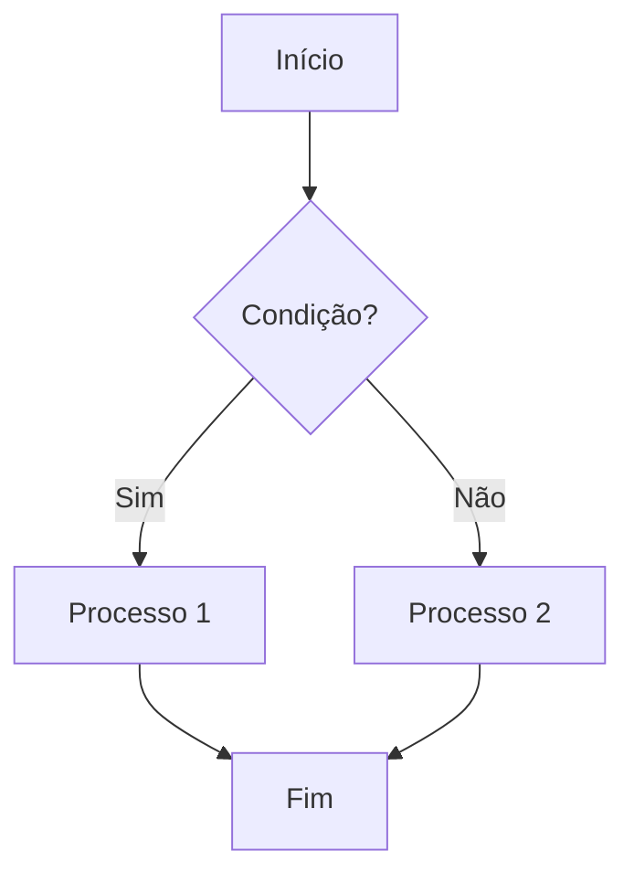
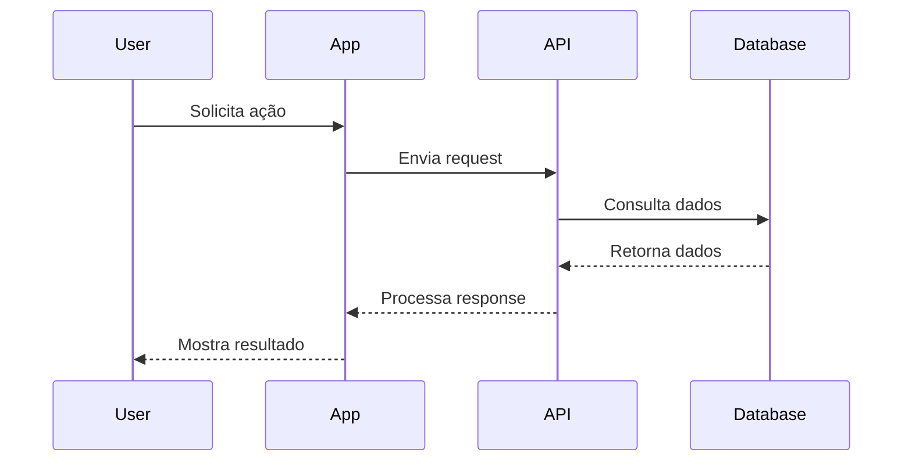
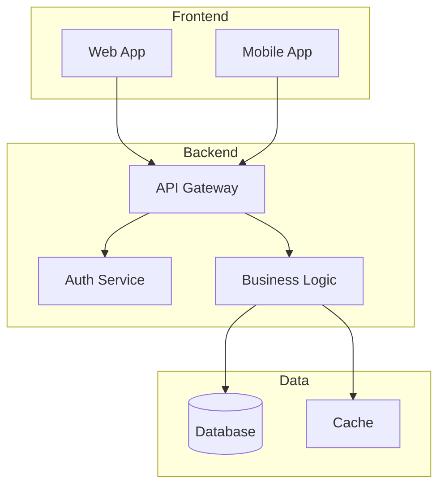
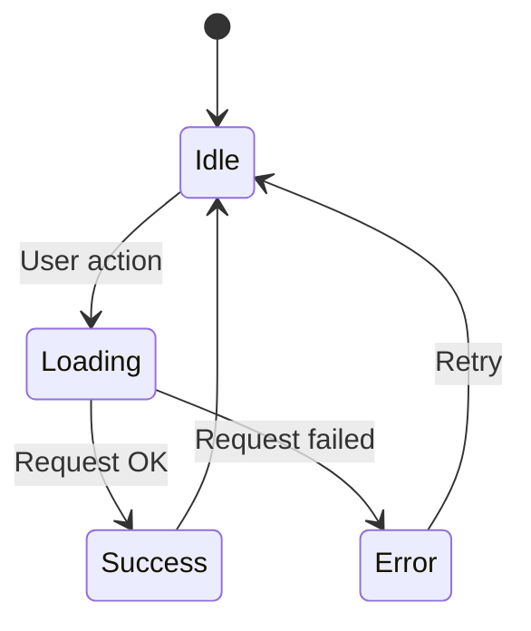
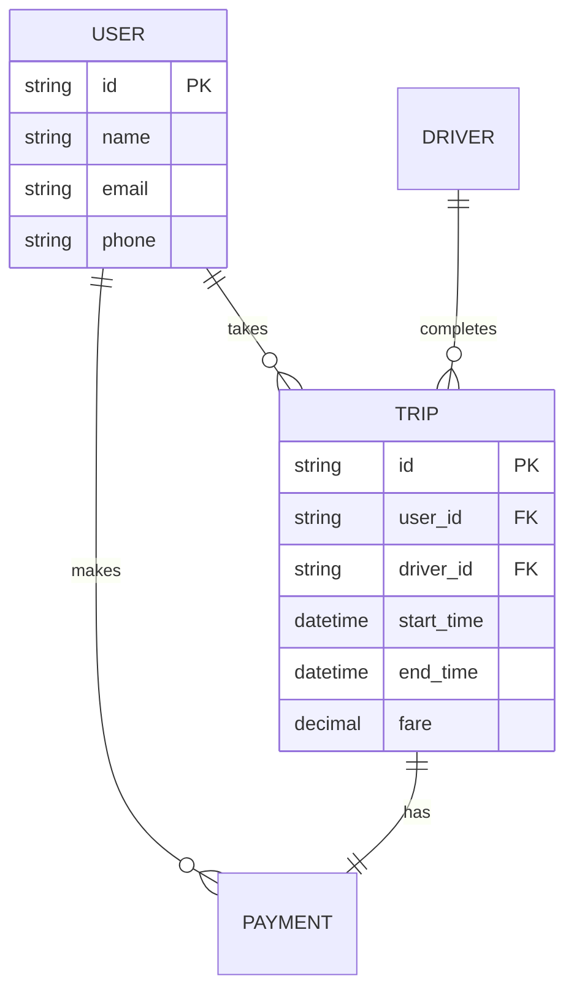
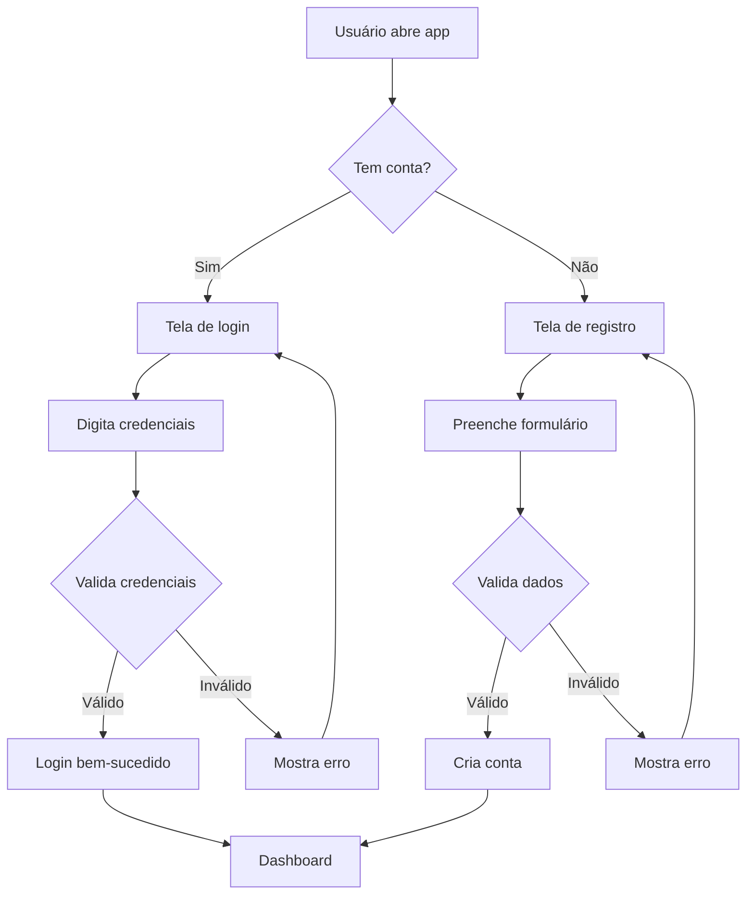
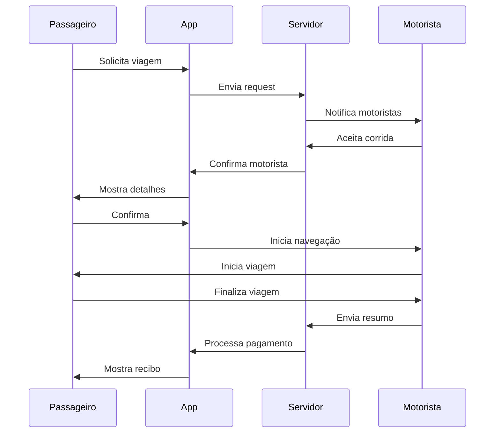
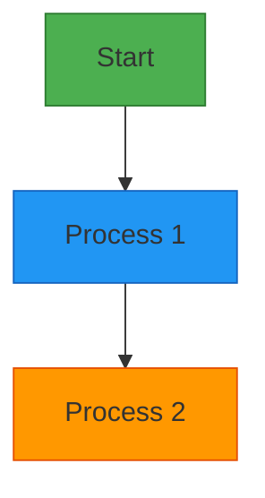
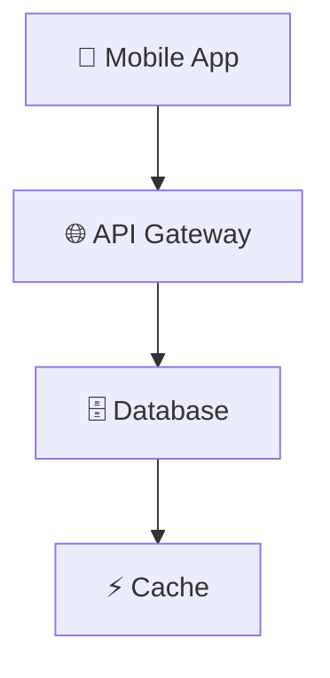

# 📊 Template de Diagramas Mermaid

## 🎯 Objetivo
Template padronizado para criar diagramas Mermaid consistentes em toda a documentação.

## 📋 Tipos de Diagramas

### 1. Fluxo de Processo (Flowchart)

### 2. Sequência de Interações (Sequence)

### 3. Arquitetura do Sistema (C4 Model)

### 4. Estados de Componente (State)

### 5. Relacionamento de Dados (ER)

## 🎨 Padrões Visuais

### Cores por Tipo
- **Frontend**: `#4CAF50` (Verde)
- **Backend**: `#2196F3` (Azul)
- **Database**: `#FF9800` (Laranja)
- **External**: `#9C27B0` (Roxo)

### Ícones e Labels
- **Usuário**: 👤 User
- **Sistema**: 🖥️ System
- **API**: 🔌 API
- **Database**: 🗄️ DB
- **Cache**: ⚡ Cache

## 📝 Guia de Estilo

### Nomenclatura
- Use nomes descritivos em inglês
- Evite abreviações
- Use PascalCase para componentes
- Use camelCase para variáveis

### Organização
- Agrupe componentes relacionados
- Use subgraphs para contexto
- Mantenha fluxo da esquerda para direita
- Limite a 10 elementos por diagrama

## 🔄 Templates Prontos

### Template: Fluxo de Autenticação

### Template: Fluxo de Viagem

## 🎨 Personalização

### Adicionar Cores Personalizadas

### Adicionar Ícones

## 🔧 Ferramentas Úteis

### Editores Online
- [Mermaid Live Editor](https://mermaid.live)
- [Mermaid Chart](https://mermaidchart.com)

### VS Code Extensions
- **Mermaid Preview**: Preview em tempo real
- **Markdown All in One**: Atalhos úteis
- **Mermaid Markdown Syntax Highlighting**: Colorização de sintaxe

## ✅ Checklist de Qualidade

Antes de publicar um diagrama:
- [ ] Todos os textos estão em português
- [ ] Cores seguem o padrão definido
- [ ] Fluxo é claro e lógico
- [ ] Não há mais de 10 elementos
- [ ] Legenda está incluída quando necessário
- [ ] Diagrama é responsivo
- [ ] Testado no modo escuro

## 📚 Exemplos Completos

Veja exemplos reais em:
- [Fluxo de Registro](../technical/flows/auth/user-registration.md)
- [Fluxo de Viagem](../technical/flows/trip/trip-request.md)
- [Arquitetura do Sistema](../technical/architecture/overview.md)

---

  
**[← Voltar aos templates](./)** | **[Ver exemplos práticos →](../technical/flows/)**

