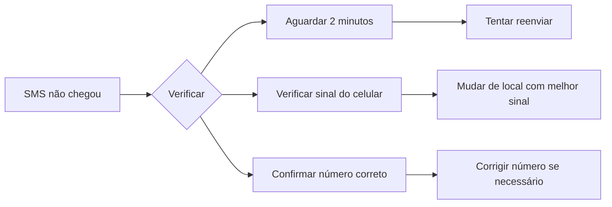
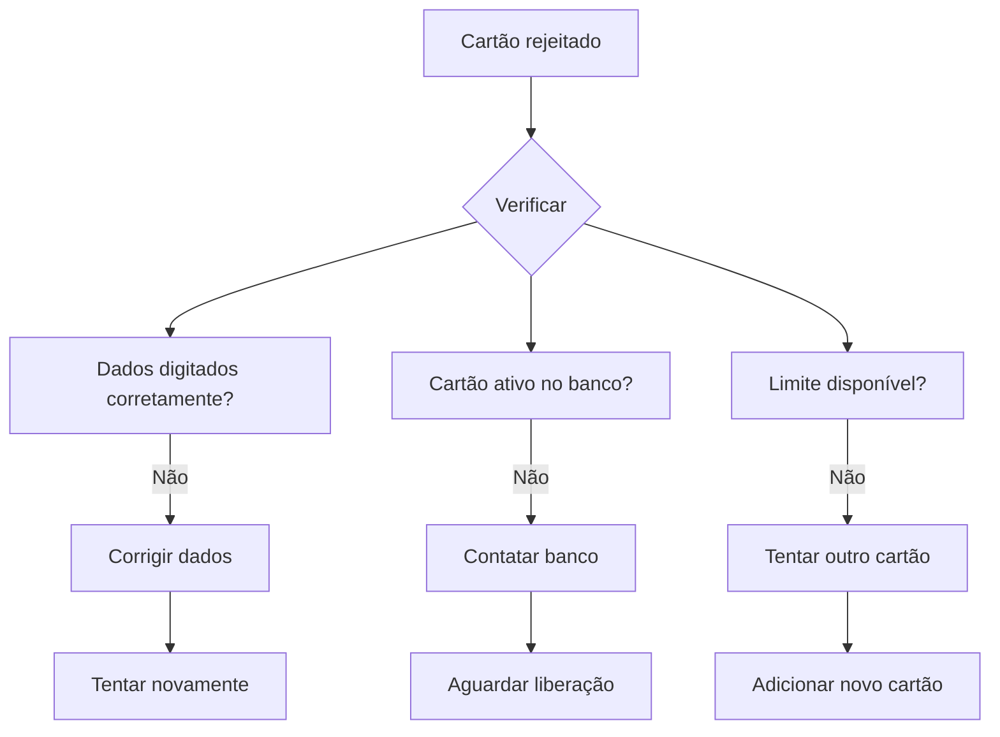
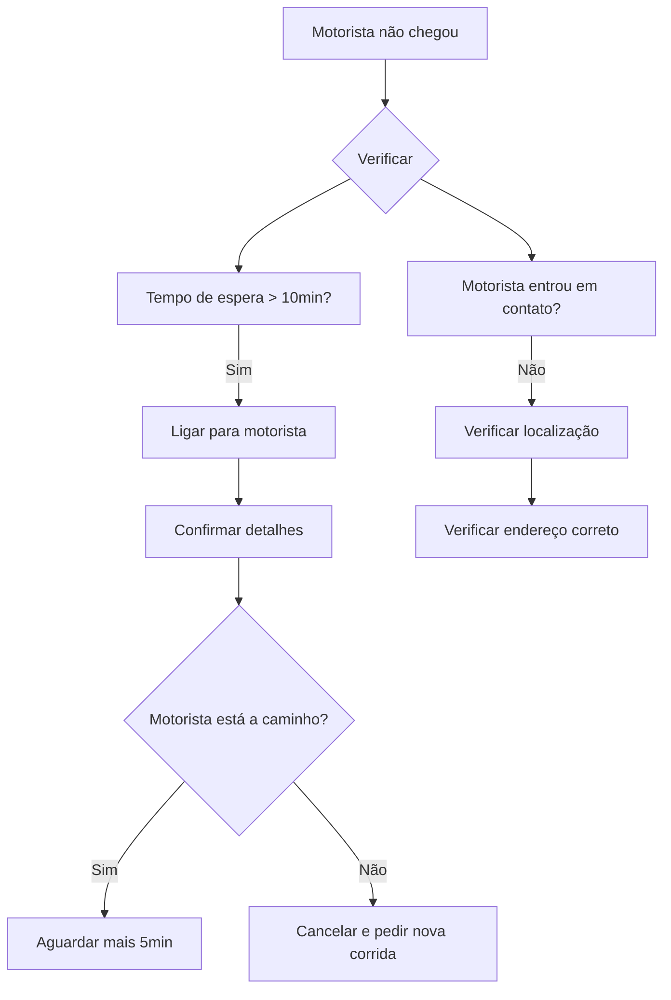

# 🔧 GUIA COMPLETO DE SOLUÇÃO DE PROBLEMAS - OPTION APP

> **Versão:** 1.0.0  
> **Última atualização:** 03/09/2025  
> **Público-alvo:** Passageiros e Motoristas

## 📋 ÍNDICE RÁPIDO

- [🆘 Problemas de Login e Autenticação](#login)
- [📍 Problemas de Localização e GPS](#gps)
- [💳 Problemas de Pagamento](#pagamento)
- [🚗 Problemas de Viagem](#viagem)
- [📱 Problemas Técnicos do App](#tecnico)
- [👨‍💼 Problemas com Motoristas](#motoristas)
- [👤 Problemas com Passageiros](#passageiros)
- [📄 Problemas de Documentação](#documentacao)
- [📊 Problemas de Disponibilidade](#disponibilidade)

---

<a name="login"></a>
## 🆘 1. PROBLEMAS DE LOGIN E AUTENTICAÇÃO

### 🔐 Esqueci minha senha

**Sintomas:**
- Não consigo lembrar minha senha
- Mensagem "Senha incorreta" mesmo digitando corretamente

**Solução passo a passo:**

```mermaid
graph TD
    A[Esqueceu a senha?] -->|Sim| B[Clique em "Esqueci minha senha"]
    B --> C[Digite seu e-mail cadastrado]
    C --> D[Verifique sua caixa de e-mail]
    D --> E[Clique no link de recuperação]
    E --> F[Digite nova senha]
    F --> G[Confirme a nova senha]
    G --> H[Login realizado com sucesso!]
```

**Códigos de erro comuns:**
- `AUTH-001`: E-mail não encontrado
- `AUTH-002`: Link expirado (válido por 24h)
- `AUTH-003`: Senha fraca (mínimo 8 caracteres)

**Solução alternativa:**
Se não receber o e-mail em 15 minutos:
1. Verifique a pasta de spam
2. Tente com outro e-mail que possa ter usado
3. Entre em contato: suporte@optionapp.com.br

### 🔒 Conta bloqueada

**Sintomas:**
- Mensagem "Conta temporariamente bloqueada"
- Múltiplas tentativas de login falhadas

**Solução:**
1. **Aguarde 30 minutos** para o bloqueio automático expirar
2. Se continuar bloqueada:
   - Envie e-mail para: seguranca@optionapp.com.br
   - Assunto: "Desbloqueio de conta - [seu e-mail]"
   - Anexe: Foto do RG/CPF para verificação

**[SCREENSHOT_AQUI] - Tela de conta bloqueada**

### ❌ Erro "usuário não encontrado"

**Causas possíveis:**
| Causa | Solução |
|-------|---------|
| E-mail digitado incorretamente | Verifique digitação e tente novamente |
| Conta criada com outro e-mail | Tente outros e-mails que possui |
| Conta excluída | Crie uma nova conta |
| Digitação com espaços extras | Remova espaços antes/depois do e-mail |

### 📱 Problemas com verificação SMS

**Fluxo de resolução:**



**Dicas de solução:**
- ✅ Verifique se o número está no formato correto: +55 DDD NÚMERO
- ✅ Certifique-se de ter créditos/saldo para receber SMS
- ✅ Desative bloqueadores de spam temporariamente
- ❌ Não peça código mais de 3 vezes em 1 hora

### 🔗 Login com Google/Facebook não funciona

**Checklist de verificação:**
- [ ] O app Option tem permissão para acessar sua conta Google/Facebook
- [ ] Você está usando a mesma conta Google/Facebook original
- [ ] Sua conta Google/Facebook não está suspensa
- [ ] O app está atualizado na loja

**Solução alternativa:**
1. Desconecte a conta nas configurações do app
2. Limpe o cache do app (Android: Configurações > Apps > Option > Armazenamento > Limpar cache)
3. Tente fazer login novamente

---

<a name="gps"></a>
## 📍 2. PROBLEMAS DE LOCALIZAÇÃO E GPS

### 📍 GPS não localiza endereço correto

**Tabela de sintomas vs soluções:**

| Sintoma | Solução imediata | Solução alternativa |
|---------|------------------|---------------------|
| Endereço aparece errado | Arraste o pin no mapa | Digite manualmente o endereço |
| Número da casa incorreto | Use "Ajustar localização" | Adicione observações para o motorista |
| Localização em branco | Reinicie o GPS do celular | Use endereço de ponto de referência |

### 📡 Localização imprecisa

**Passos para resolver:**

1. **Verificar configurações do celular:**
   ```
   Android: Configurações > Localização > Modo > Alta precisão
   iOS: Ajustes > Privacidade > Serviços de Localização > Option > Sempre
   ```

2. **Verificar permissões do app:**
   - [SCREENSHOT_AQUI] - Configurações de permissão

3. **Testar localização:**
   - Abra o Google Maps para comparar precisão
   - Verifique se está em local aberto (sem prédios altos)

### 🌍 "Fora da área de cobertura"

**O que fazer:**

| Área | Solução |
|------|---------|
| Periferia | Tente local mais próximo ao centro |
| Cidade pequena | Verifique cidades vizinhas com cobertura |
| Viagem | Use transporte até área com cobertura |
| Fronteira | Pode haver restrições geográficas |

### 🔄 GPS desatualizado

**Como atualizar:**
- **Android:** Configurações > Localização > Google Location Accuracy > Ativar
- **iOS:** Ajustes > Geral > Atualização de Localização > Ativar

---

<a name="pagamento"></a>
## 💳 3. PROBLEMAS DE PAGAMENTO

### 💳 Cartão não é aceito

**Códigos de erro e soluções:**

| Código | Significado | Solução |
|--------|-------------|---------|
| CARD-001 | Cartão bloqueado | Contate seu banco |
| CARD-002 | Saldo insuficiente | Verifique saldo ou use outro cartão |
| CARD-003 | Dados incorretos | Verifique número, validade e CVV |
| CARD-004 | Cartão expirado | Use outro cartão ou atualize dados |

**Fluxo de resolução:**



### 💸 Erro na transação

**Checklist de verificação:**
- [ ] Internet está funcionando
- [ ] Cartão tem limite disponível
- [ ] Dados do cartão estão corretos
- [ ] App está atualizado
- [ ] Tentar com outro cartão

### 💰 Valor cobrado incorretamente

**O que fazer:**
1. **Anote os detalhes:**
   - Valor correto que deveria ser cobrado
   - Valor que foi cobrado
   - Data e hora da corrida
   - Nome do motorista

2. **Entre em contato:**
   - E-mail: financeiro@optionapp.com.br
   - Assunto: "Divergência de valor - [sua corrida]"
   - Resposta em até 48h úteis

### 🔄 Reembolso pendente

**Status do reembolso:**

| Status | Significado | Prazo |
|--------|-------------|--------|
| Pendente | Aguardando análise | Até 3 dias úteis |
| Aprovado | Liberado para estorno | 5-10 dias úteis |
| Concluído | Valor estornado | Verificar extrato |

### 💵 Troco em dinheiro

**Para motoristas:**
- Sempre tenha troco para R$ 50,00
- Comunique ao passageiro sobre troco antes da corrida
- Use a calculadora do app para conferir valores

---

<a name="viagem"></a>
## 🚗 4. PROBLEMAS DE VIAGEM

### 🕐 Motorista não chegou

**Fluxo de ação:**



**Contatos de emergência:**
- Suporte Option: 0800-123-4567
- WhatsApp: (11) 98765-4321

### 👤 Passageiro não apareceu

**Para motoristas:**
1. **Aguarde 5 minutos** no local combinado
2. **Ligue para o passageiro** (máximo 3 tentativas)
3. **Envie mensagem** pelo chat do app
4. **Cancele com justificativa** "Passageiro não apareceu"
5. **Receba taxa de cancelamento** automática

### ❌ Cancelamento de corrida

**Taxas de cancelamento:**

| Momento do cancelamento | Taxa passageiro | Taxa motorista |
|------------------------|-----------------|----------------|
| Antes do motorista chegar | R$ 7,00 | Não se aplica |
| Após motorista chegar | R$ 15,00 | Não se aplica |
| Motorista cancela | Sem taxa | Pode perder bônus |

### 💰 Valor da corrida incorreto

**Como contestar:**
1. **Finalize a corrida normalmente**
2. **Acesse:** Menu > Suas viagens > Selecione a corrida
3. **Toque em:** "Problemas com esta viagem"
4. **Escolha:** "Valor incorreto"
5. **Descreva:** Explique o problema detalhadamente

### 🗺️ Rota errada ou desvio

**Para passageiros:**
1. **Comunique imediatamente** ao motorista
2. **Use o chat do app** para registrar
3. **Se necessário:** Peça para parar em local seguro
4. **Após a viagem:** Avalie e relate o problema

---

<a name="tecnico"></a>
## 📱 5. PROBLEMAS TÉCNICOS DO APP

### 📱 App travando ou fechando

**Solução por sistema:**

**Android:**
1. Limpar cache: Configurações > Apps > Option > Armazenamento > Limpar cache
2. Limpar dados: Mesma tela > Limpar dados (necessário fazer login novamente)
3. Reinstalar: Desinstalar e baixar novamente

**iOS:**
1. Forçar fechamento: Deslizar para cima > Fechar app
2. Reiniciar iPhone
3. Reinstalar: Segurar ícone > Remover app > Baixar novamente

### 🔔 Não recebo notificações

**Checklist de configuração:**

| Android | iOS |
|---------|-----|
| Configurações > Apps > Option > Notificações > Ativar | Ajustes > Notificações > Option > Permitir |
| Verificar modo Não perturbar | Verificar se está no modo silencioso |
| Verificar volume de notificações | Verificar se tem conexão com internet |

### 🌐 Erro de conexão

**Códigos de erro:**

| Código | Significado | Solução |
|--------|-------------|---------|
| NET-001 | Sem internet | Verificar Wi-Fi/dados móveis |
| NET-002 | Conexão instável | Mudar de rede ou aguardar |
| NET-003 | Timeout | Reiniciar app ou celular |

### 🔄 App não atualiza

**Como forçar atualização:**
- **Android:** Play Store > Meus apps > Option > Atualizar
- **iOS:** App Store > Perfil > Option > Atualizar
- **Se não aparecer:** Desinstalar e instalar novamente

### 📸 Problemas com fotos/documentos

**Dicas para fotos:**
- ✅ Use luz natural ou ambiente bem iluminado
- ✅ Mantenha o documento plano e sem sombras
- ✅ Certifique-se que todos os dados estão legíveis
- ❌ Não use flash que cause reflexo
- ❌ Não corte as bordas do documento

---

<a name="motoristas"></a>
## 👨‍💼 6. PROBLEMAS COM MOTORISTAS

### 😡 Motorista mal educado

**Como proceder:**
1. **Durante a viagem:** Mantenha a calma, não discuta
2. **Após a viagem:** Avalie com 1 estrela
3. **Denuncie:** Menu > Suas viagens > Selecione > "Denunciar motorista"
4. **Descreva:** Detalhe o comportamento inadequado

**Canais de denúncia:**
- Chat no app: Suporte > Falar com atendente
- E-mail: ouvidoria@optionapp.com.br
- Telefone: 0800-123-4567

### 🚗 Veículo em más condições

**Checklist de segurança:**
- [ ] Carro limpo e organizado
- [ ] Cinto de segurança funcionando
- [ ] Ar condicionado adequado
- [ ] Sem barulhos estranhos
- [ ] Documentos do veículo visíveis

**Se encontrar problemas:**
1. **Recuse a viagem** se sentir insegurança
2. **Informe ao app** imediatamente
3. **Solicite novo motorista**

### 🗺️ Motorista não seguiu rota

**Como agir:**
1. **Comunique:** "Por favor, seguir o GPS"
2. **Mostre:** Aponte a rota no seu app
3. **Registre:** Use o chat para registrar
4. **Após a viagem:** Relate o problema

### 🚫 Recusa de corrida

**Motivos válidos para recusa:**
- Passageiro fora da área de cobertura
- Destino muito distante (aviso prévio)
- Problemas técnicos no app
- Questões de segurança

**Se for recusado injustamente:**
1. **Anote:** Nome do motorista e placa
2. **Reporte:** Use "Denunciar motorista"
3. **Solicite:** Nova corrida imediatamente

---

<a name="passageiros"></a>
## 👤 7. PROBLEMAS COM PASSAGEIROS

### 😤 Passageiro agressivo

**Para motoristas:**
1. **Priorize sua segurança**
2. **Mantenha distância**
3. **Use o botão de pânico** se necessário
4. **Encerre a viagem** em local seguro
5. **Reporte imediatamente**

**Botão de emergência:**
- Localizado no canto superior direito durante a viagem
- [SCREENSHOT_AQUI] - Botão de emergência

### 💳 Passageiro não quer pagar

**Procedimento:**
1. **Mostre o valor** no app
2. **Explique:** Valor é calculado automaticamente
3. **Ofereça:** Ver detalhes da rota
4. **Se persistir:** Use botão de suporte

### 📍 Destino incorreto

**Como corrigir:**
1. **Durante a viagem:** Peça para alterar no app
2. **Motorista pode:** Adicionar nova parada
3. **Valor será:** Recalculado automaticamente
4. **Confirme:** Com o passageiro antes de seguir

### 🛑 Múltiplas paradas não previstas

**Política do app:**
- **1ª parada:** Incluída no valor
- **Paradas extras:** R$ 2,00 cada
- **Máximo:** 3 paradas adicionais
- **Tempo máximo:** 5 minutos por parada

### 🧳 Bagagem excessiva

**Limites por categoria:**

| Categoria | Malas grandes | Malas pequenas |
|-----------|---------------|----------------|
| Básico | 1 | 2 |
| Confort | 2 | 3 |
| Black | 3 | 4 |

---

<a name="documentacao"></a>
## 📄 8. PROBLEMAS DE DOCUMENTAÇÃO

### ❌ Documentos rejeitados

**Tabela de rejeições comuns:**

| Documento | Motivo rejeição | Solução |
|-----------|-----------------|---------|
| CNH | Foto borrada | Tire nova foto com luz adequada |
| CRLV | Dados cortados | Certifique-se que todos os campos aparecem |
| Foto perfil | Rosto não visível | Use foto de rosto, sem óculos escuros |
| Comprovante | Endereço ilegível | Use comprovante recente (máx. 3 meses) |

### 📋 CNH vencida

**O que fazer:**
1. **Renove sua CNH** no Detran
2. **Enquanto isso:** Sua conta será pausada
3. **Após renovação:** Faça upload da nova CNH
4. **Tempo de análise:** Até 24h úteis

### 🚗 CRLV não aceito

**Verificações:**
- ✅ CRLV deve ser do ano vigente
- ✅ Todos os campos devem estar legíveis
- ✅ Veículo deve estar em seu nome
- ❌ CRLV digital deve ser baixado oficialmente

### 📸 Foto de perfil rejeitada

**Requisitos obrigatórios:**
- Foto de rosto clara
- Sem filtros ou edições
- Fundo neutro
- Rosto ocupando 70% da foto
- Sem óculos escuros ou chapéu

### 🏠 Comprovante de endereço

**Aceitos:**
- Conta de luz, água, gás (máx. 3 meses)
- Extrato bancário com endereço
- Contrato de locação atualizado
- Declaração de IR com endereço

**Não aceitos:**
- Notas fiscais
- Comprovantes manuscritos
- Documentos rasurados

---

<a name="disponibilidade"></a>
## 📊 9. PROBLEMAS DE DISPONIBILIDADE

### 🔍 Não encontro motoristas

**Tabela de causas e soluções:**

| Hora | Causa provável | Solução |
|------|----------------|---------|
| 00h-05h | Poucos motoristas online | Tente aplicativos alternativos |
| 07h-09h | Pico da manhã | Agende com antecedência |
| 12h-14h | Hora do almoço | Tente regiões comerciais |
| 17h-19h | Pico da tarde | Considere transporte público |
| 22h-00h | Fim de expediente | Tente áreas de entretenimento |

### 📱 Não recebo corridas (motoristas)

**Dicas para aumentar chances:**

1. **Posicionamento estratégico:**
   - Fique próximo a shoppings, aeroportos, hospitais
   - Evite ficar em becos ou vias sem movimento
   - Use o mapa de calor do app

2. **Horários de pico:**
   - Seg-Sex: 6h-9h e 17h-20h
   - Sáb: 20h-02h
   - Dom: 10h-14h e 18h-22h

### 🗺️ Área sem cobertura

**Verificar cobertura:**
- **Site:** www.optionapp.com.br/cobertura
- **Digite seu CEP** para verificar
- **Cidades com cobertura** são atualizadas mensalmente

### ⏰ Horários de pico

**Preços dinâmicos:**

| Período | Multiplicador | Dica |
|---------|---------------|------|
| Normal | 1.0x | Use sem restrições |
| Moderado | 1.2x | Aguarde 15-30 min |
| Alto | 1.5x | Considere alternativas |
| Extremo | 2.0x+ | Use transporte público |

### 🎉 Eventos especiais

**Planejamento:**
- **Confira:** Calendário de eventos no app
- **Agende:** Corridas com 2h de antecedência
- **Alternativas:** Considere saída antecipada
- **Preços:** Podem ser até 3x maiores

---

## 📞 CONTATOS DE SUPORTE

### 🆘 Emergências
- **Polícia:** 190
- **Samu:** 192
- **Bombeiros:** 193

### 📱 Suporte Option
| Departamento | Contato | Horário |
|--------------|---------|---------|
| Geral | 0800-123-4567 | 24h |
| WhatsApp | (11) 98765-4321 | 24h |
| E-mail geral | suporte@optionapp.com.br | 24h |
| Financeiro | financeiro@optionapp.com.br | Seg-Sex 9h-18h |
| Segurança | seguranca@optionapp.com.br | 24h |
| Motoristas | motoristas@optionapp.com.br | 24h |

### 🌐 Recursos Online
- **Site:** www.optionapp.com.br/ajuda
- **FAQ:** Perguntas frequentes atualizadas
- **Chat:** Disponível no app e site
- **Vídeos tutoriais:** YouTube.com/OptionApp

---

## ✅ CHECKLIST FINAL

Antes de entrar em contato com o suporte, verifique:

**Para todos os problemas:**
- [ ] App está atualizado
- [ ] Internet está funcionando
- [ ] Reiniciou o celular
- [ ] Verificou as configurações
- [ ] Tentou as soluções deste guia

**Informações necessárias para suporte:**
- Nome completo
- E-mail cadastrado
- Número do celular
- Descrição detalhada do problema
- Screenshots (se possível)
- Data e hora do ocorrido

---

## 🔄 ATUALIZAÇÕES DO GUIA

Este guia é atualizado mensalmente com base nos problemas mais frequentes reportados pelos usuários.

**Últimas atualizações:**
- ✅ Adicionada seção sobre eventos especiais
- ✅ Novos códigos de erro de pagamento
- ✅ Atualização dos contatos de suporte
- ✅ Inclusão de fluxogramas visuais

---

**📧 Feedback:** Ajude-nos a melhorar! Envie sugestões para: feedback@optionapp.com.br

**Documento versão:** 1.0.0 | © 2025 Option App - Todos os direitos reservados