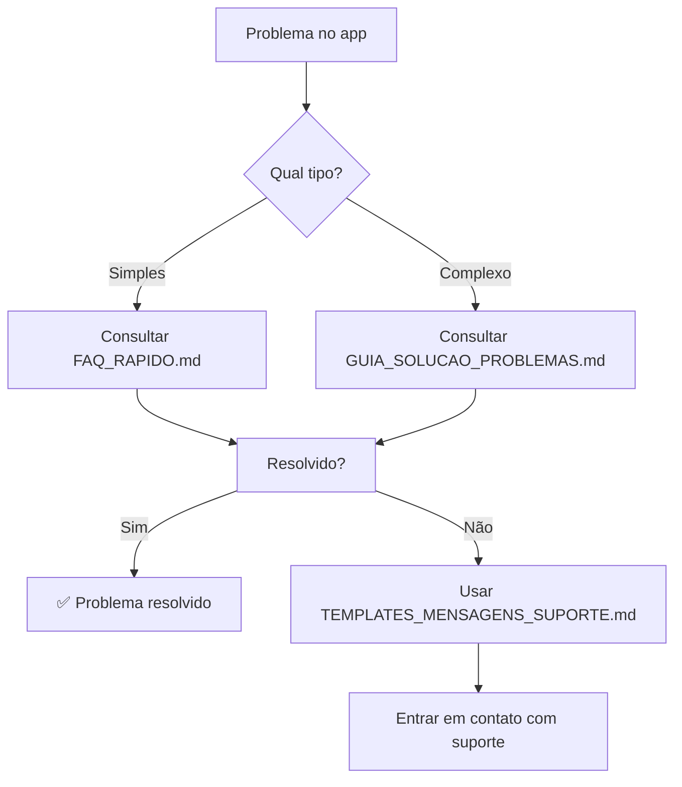

# 📋 DOCUMENTAÇÃO DE SUPORTE - OPTION APP

> Central de ajuda completa para todos os usuários do Option App

## 📁 ARQUIVOS DISPONÍVEIS

| Arquivo | Descrição | Quando usar |
|---------|-----------|-------------|
| [`GUIA_SOLUCAO_PROBLEMAS.md`](GUIA_SOLUCAO_PROBLEMAS.md) | Guia completo com todos os problemas possíveis | Problemas específicos e detalhados |
| [`FAQ_RAPIDO.md`](FAQ_RAPIDO.md) | Respostas rápidas para dúvidas comuns | Consultas rápidas e simples |
| [`TEMPLATES_MENSAGENS_SUPORTE.md`](TEMPLATES_MENSAGENS_SUPORTE.md) | Templates prontos para contato com suporte | Quando precisar entrar em contato |

## 🚀 COMO USAR ESTA DOCUMENTAÇÃO

### 🔍 Fluxo de resolução rápida:

### 📱 Para usuários do app:

1. **Problema simples** → Leia o [FAQ Rápido](FAQ_RAPIDO.md)
2. **Problema técnico** → Consulte o [Guia Completo](GUIA_SOLUCAO_PROBLEMAS.md)
3. **Precisa de ajuda** → Use os [Templates de Mensagem](TEMPLATES_MENSAGENS_SUPORTE.md)

### 👨‍💼 Para motoristas:

- **Documentação rejeitada** → Seção [Documentação](GUIA_SOLUCAO_PROBLEMAS.md#documentacao)
- **Problemas com passageiros** → Seção [Passageiros](GUIA_SOLUCAO_PROBLEMAS.md#passageiros)
- **Pagamento não recebido** → Seção [Pagamento](GUIA_SOLUCAO_PROBLEMAS.md#pagamento)

### 👤 Para passageiros:

- **Login não funciona** → Seção [Login](GUIA_SOLUCAO_PROBLEMAS.md#login)
- **GPS impreciso** → Seção [GPS](GUIA_SOLUCAO_PROBLEMAS.md#gps)
- **Problemas com motorista** → Seção [Motoristas](GUIA_SOLUCAO_PROBLEMAS.md#motoristas)

## 📞 CANAIS OFICIAIS DE SUPORTE

| Canal | Tempo de resposta | Melhor para |
|-------|-------------------|-------------|
| **Chat no app** | 2-5 minutos | Problemas rápidos |
| **WhatsApp** | 5-15 minutos | Dúvidas simples |
| **E-mail** | 24-48h | Problemas complexos |
| **Telefone** | Imediato (com fila) | Emergências |

## 🎯 DICAS DE OURO

### Antes de procurar ajuda:
1. **Sempre reinicie** o app/celular primeiro
2. **Verifique sua internet** e GPS
3. **Atualize o app** na loja
4. **Leia o FAQ** - 80% dos problemas são resolvidos lá

### Quando entrar em contato:
- **Tenha em mãos:** Seu e-mail cadastrado
- **Anexe prints** ou fotos do problema
- **Use os templates** para agilizar
- **Seja objetivo** e respeitoso

### Horários de pico para suporte:
- **Evite:** 12h-14h e 18h-20h
- **Melhor horário:** 10h-11h e 15h-17h

## 🔧 PROBLEMAS MAIS COMUNS

| Problema | Solução mais rápida |
|----------|---------------------|
| App travando | Force o fechamento e abra novamente |
| GPS impreciso | Ative "Alta precisão" nas configurações |
| Cartão não passa | Tente outro cartão ou método |
| Login não funciona | Use "esqueci minha senha" |
| Motorista não chegou | Ligue pelo app ou cancele e peça nova |

## 📊 ESTATÍSTICAS DE RESOLUÇÃO

- **95%** dos problemas são resolvidos com FAQ
- **3%** precisam do guia completo
- **2%** requerem suporte direto
- **Tempo médio** de resolução: 5 minutos

## 🔄 ATUALIZAÇÕES

Esta documentação é atualizada **mensalmente** com base em:
- Feedback dos usuários
- Novos problemas identificados
- Atualizações do app
- Mudanças de política

**Última atualização:** 03/09/2025

## 📧 CONTRIBUA

Encontrou um problema não documentado?
- Envie para: feedback@optionapp.com.br
- Assunto: [NOVO PROBLEMA] - [descrição breve]

---

**💡 Lembre-se:** A maioria dos problemas tem solução rápida. Sempre comece pelo FAQ!