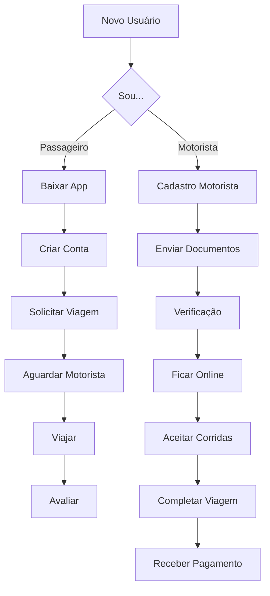

# 🎓 Tutorial do Usuário Final - Option

## 🎯 Objetivo
Guias práticos e tutoriais passo a passo para passageiros e motoristas usarem o aplicativo Option com facilidade.

## 📱 Índice de Conteúdo

### 👥 Para Passageiros

#### 🚀 Primeiros Passos
- [Como Baixar o App](getting-started/download-app.md)
- [Como Criar uma Conta](getting-started/create-account.md)
- [Como Solicitar sua Primeira Viagem](passenger/requesting-trip.md)
- [Como Adicionar Formas de Pagamento](passenger/payment-methods.md)

#### 📍 Usando o App
- [Como Definir Locais Favoritos](passenger/saved-places.md)
- [Como Agendar uma Viagem](passenger/schedule-trip.md)
- [Como Compartilhar sua Viagem](passenger/share-trip.md)
- [Como Avaliar sua Viagem](passenger/rating-trip.md)

#### 💰 Pagamentos e Promoções
- [Como Usar Código Promocional](passenger/promo-codes.md)
- [Como Ver Histórico de Viagens](passenger/trip-history.md)
- [Como Solicitar Nota Fiscal](passenger/invoice-request.md)

### 🚗 Para Motoristas

#### 📝 Cadastro e Documentação
- [Como se Cadastrar como Motorista](driver/driver-registration.md)
- [Documentos Necessários](driver/required-documents.md)
- [Como Enviar Documentos](driver/document-upload.md)
- [Verificação de Conta](driver/account-verification.md)

#### 💼 Trabalhando com o Option
- [Como Ficar Online](driver/go-online.md)
- [Como Aceitar Corridas](driver/accepting-trips.md)
- [Como Navegar até o Passageiro](driver/navigation.md)
- [Como Finalizar uma Viagem](driver/complete-trip.md)

#### 💳 Financeiro
- [Como Ver seus Ganhos](driver/earnings-dashboard.md)
- [Como Sacar Dinheiro](driver/withdraw-earnings.md)
- [Como Ver Extrato Financeiro](driver/financial-statement.md)

### 🆘 Problemas Comuns

#### 📱 Problemas Técnicos
- [App não abre](troubleshooting/app-wont-open.md)
- [Erro de localização](troubleshooting/location-issues.md)
- [Problemas de conexão](troubleshooting/connection-issues.md)
- [App travando](troubleshooting/app-crashing.md)

#### 💳 Problemas de Pagamento
- [Cartão não é aceito](troubleshooting/payment-issues.md)
- [Cobrança duplicada](troubleshooting/double-charge.md)
- [Reembolso solicitado](troubleshooting/refund-request.md)

#### 🔐 Problemas de Conta
- [Esqueci minha senha](troubleshooting/forgot-password.md)
- [Conta bloqueada](troubleshooting/account-blocked.md)
- [Mudar número de telefone](troubleshooting/change-phone.md)

## 🎯 Guias Rápidos por Público

### Sou Passageiro e...
- **Quero pedir minha primeira viagem** → [Começar aqui](passenger/requesting-trip.md)
- **Quero adicionar cartão de crédito** → [Pagamento](passenger/payment-methods.md)
- **Tive um problema na corrida** → [Problemas](troubleshooting/trip-issues.md)

### Sou Motorista e...
- **Quero me cadastrar** → [Cadastro](driver/driver-registration.md)
- **Quero começar a dirigir hoje** → [Primeiros passos](driver/getting-started.md)
- **Quero sacar meus ganhos** → [Financeiro](driver/withdraw-earnings.md)

## 📊 Diagrama de Fluxo do Usuário

## 📱 Compatibilidade

### Sistemas Operacionais
- **iOS**: 12.0 ou superior
- **Android**: 7.0 ou superior

### Requisitos Mínimos
- **Memória RAM**: 2GB
- **Espaço livre**: 100MB
- **Internet**: 3G ou superior

## 🆘 Suporte ao Usuário

### Canais de Atendimento
- **WhatsApp**: (11) 99999-9999
- **Email**: suporte@option.com.br
- **Chat no app**: Menu > Ajuda
- **Telefone**: 0800 123 4567

### Horário de Atendimento
- **Segunda a Sexta**: 6h às 22h
- **Sábado e Domingo**: 8h às 20h
- **Feriados**: 9h às 18h

## 📈 Dicas de Ouro

### Para Passageiros 💡
- **Economize**: Use corridas compartilhadas em horários de pico
- **Segurança**: Sempre confira placa e modelo do carro
- **Agilidade**: Salve seus locais favoritos
- **Pagamento**: Adicione múltiplos cartões para backup

### Para Motoristas 🚗
- **Ganhos**: Fique online em áreas de alta demanda
- **Avaliação**: Mantenha carro limpo e seja educado
- **Eficiência**: Use o GPS do app para rotas otimizadas
- **Financeiro**: Faça saques toda semana para evitar acúmulo

## 🎓 Tutoriais em Vídeo

### Passageiros
- [Como solicitar viagem (2min)](https://youtube.com/option-passenger-request)
- [Como adicionar pagamento (1min)](https://youtube.com/option-passenger-payment)
- [Como agendar corrida (3min)](https://youtube.com/option-passenger-schedule)

### Motoristas
- [Cadastro completo (5min)](https://youtube.com/option-driver-registration)
- [Como aceitar corridas (2min)](https://youtube.com/option-driver-accept)
- [Como sacar ganhos (1min)](https://youtube.com/option-driver-withdraw)

---

  
**[← Voltar ao índice principal](../README.md)** | **[Sou passageiro →](passenger/README.md)** | **[Sou motorista →](driver/README.md)**

